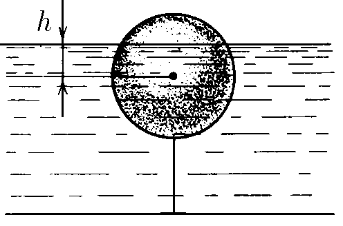

###  Statement 

$1.5.19.$ A spherical buoy of radius $R$ is attached to the bottom of the reservoir. The water level in the reservoir rises at a speed $u$. What is the speed of movement of the boundary of the flooded part of the buoy on its surface at the moment when the water level is $h$ above the center of the buoy? 

### Solution

By time $t$ the water level will be $h$

In a short period of time $dt$ the water layer will rise by 

$$ dh = u \, dt $$ 

In turn, the boundary of the flooded part will also rise by 

$$ dh = v\, dt \cos\alpha$$ 

Let's equate both equations

$$ v \cos\alpha = u $$ 

$$ v = \frac{u}{\cos\alpha} $$ 

$$ \fbox{$v = u \frac{R}{\sqrt{R^2 - h^2}}$} $$ 

#### Answer

$$v = u \frac{R}{\sqrt{R^2 - h^2}}$$ 
