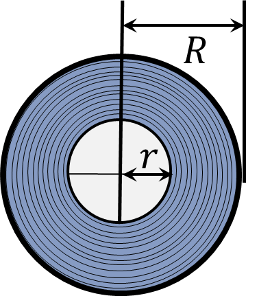

###  Statement

$1.5.20.$ The reel of tape is played back during time $t$ at the film drawing speed $v$. The initial radius of the reel (with film) is $R$, and the final radius (without film) is $r$. What is the thickness of the film?

### Solution

Film wound on a reel takes up an area

$$
S = \pi (R^2 - r^2)
$$

If the film is completely unwound at a speed of $v$ in time $t$, then the length of the film

$$
l = vt
$$

In cross-section, the film is a rectangle whose area is $S$ and length is $l$. Then the width of this rectangle (it is also the thickness of the film)

$$
\fbox{$d = \frac{S}{l} = \frac{\pi (R^2 - r^2)}{vt}$}
$$

#### Answer

$$
d = \frac{\pi (R^2 - r^2)}{vt}
$$