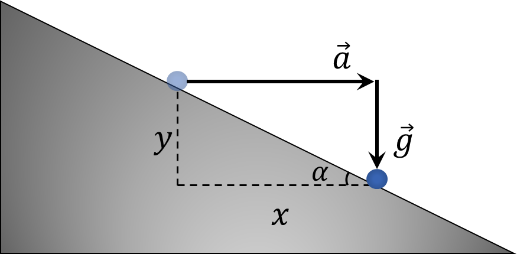

###  Statement

$1.5.4.$ A coin is placed on a wedge with an angle $\alpha$. With what minimum acceleration should the wedge move along the horizontal plane so that the coin falls freely down?

### Solution

During the time interval $t$, the coin changed its horizontal and vertical coordinates to $x$ and $y$, respectively

Considering the horizontal acceleration $a$ and the acceleration of gravity $g$, we find $x$ and $y$

$$
x = \frac{at^2}{2}
$$

$$
y = \frac{gt^2}{2}
$$

Considering that the body did not come off the wedge

$$
y = x \tan\alpha
$$

From where

$$
\fbox{$a = g \text{ ctg} \alpha$}
$$

#### Answer

$$
a = g \text{ ctg} \alpha
$$