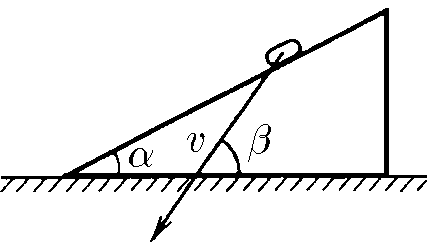
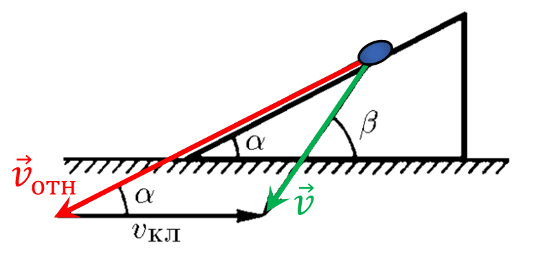

###  Statement 

$1.5.5.$ The speed of a coin sliding off a wedge is shown in the figure. Use a graphical plot to find the speed of the wedge 

### Solution

The coin has a velocity $\vec{v}_{rel}$ directed at an angle $\alpha$ to the horizon in the inertial reference frame of the wedge, which moves horizontally with a velocity $\vec{v}_{cl}$.

Then the absolute velocity $\vec{v}$ in the inertial reference frame will be equal to the vector sum of $\vec{v}_{rel}$ and $\vec{v}_{cl}$

$$\vec{v} = \vec{v}_{cl} + \vec{v}_{rel}$$

  Display of velocity vectors 

#### Answer

See figure
