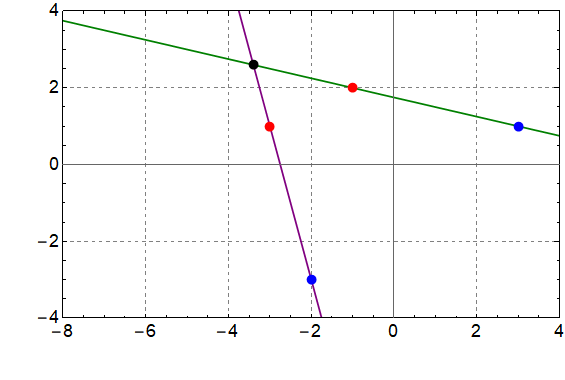

###  Statement

$1.5.6.$ A flat solid body rotates around an axis perpendicular to its plane. The coordinates of the initial position of points $A$ and $B$ of this body are ($-1$, $2$) and ($3$, $1$), and the final position is ($-3$, $1$) and ($-2$, $-3$). Use a graphical plot to find the coordinates of the rotation axis.

### Solution

Since the axis of rotation is fixed, all points of the body rotate around it and are perpendicular in direction.

If the coordinates of two points at the beginning and end are $A$, $B$ and $A'$, $B'$ respectively, then if you draw lines $AB$ and $A'B'$, their intersection point will be the center of rotation

According to constructions, this point has coordinates $(-3.4,~ 2.6)$

#### Answer

$(-3.4,\; 2.6)$