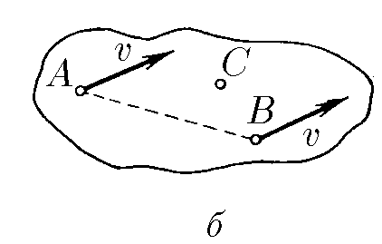

###  Statement 

$1.5.7.$ $a. $ The velocity of point $A$ of a rigid body is $v$ and forms an angle $45^{\circ}$ with the direction of line $AB$. The velocity of point $B$ of this body is $u$. Determine the projection of the velocity of point $B$ on the direction $AB$. 

b. The velocities of points $A$ and $B$ of a rigid body are $v$. The velocity of point $C$, located in the plane of line $AB$ and vector $v$, is $u > v$. Find the projection of the velocity of point $C$ on the axis perpendicular to the specified plane. 

  For problem $1.5.7.b$ 

### Solution

a) If the distances between two points are constant, then if we project the velocity of point $A$ onto line $AB$, then the projection of the velocity of point $B$ onto line $AB$ is exactly the same

$$\fbox{$u_{AB} = v/\sqrt{2}$}$$

b) The velocities of $A$ and $B$ are the same because either the body does not rotate, or its rotation occurs around line $AB$. 

The fact that the velocity of point $C$ has a different value indicates that its velocity $\vec u$ is made up of the velocity $\vec v$ in the plane of the figure and $\vec u_1$ perpendicular to the plane. 

$$\vec{u}_1+\vec{v} = \vec{u}$$

From where 

$$\fbox{$u_1 = \sqrt{u^2 - v^2}$}$$

#### Answer

a. $u_{AB} = v/\sqrt{2}$ b. $u_1 = \sqrt{u^2 − v^2}$ 
