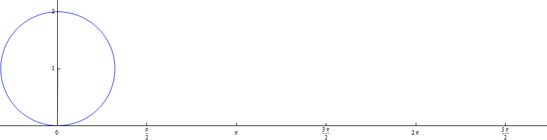

###  Statement 

$1.5.8.$ Plot the trajectories of the points of the wheel rolling without slipping on the rail. Consider cases where the points are at a distance from the wheel axis: $r > R$, $r = R$, $r < R$. Find the acceleration of these points if the wheel axis is moving at a constant speed $v$. Find the radius of curvature of the trajectory of a point located in the highest and lowest positions at a distance $r \ne R$ from the wheel axis. 

### Solution

In this case, the motion of the points is the sum of the translational velocity of the wheel center and the rotational velocity relative to this center, and the acceleration of the point is calculated using the usual formula for centripetal acceleration 

$$\fbox{$a = \omega^2 r = (v^2/R^2)r$}$$

For the case of $r< R$, taking into account both rotational and translational motion, a point located at a distance of $r$ at the top point of its trajectory has a speed of 

$$ u = \omega r + v = v(1 + \frac{r}{R}) $$ 

Knowing the acceleration $a$ and the velocity $u$ at a given point, we find its radius of curvature

$$ r = \frac{u^2}{a} $$ 

$$ \fbox{$r = \frac{(R+r)^2}{r}$} $$ 

For better understanding, I offer an illustration of the movement:

 

#### Answer

$$a=(v^2/R^2)r; r_{in}=(R+r)^2/r, r_{out}=(R-r)^2/r$$ 
