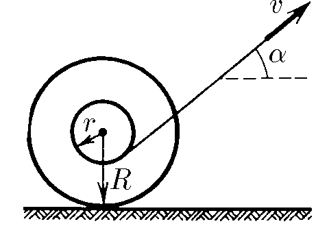

###  Statement 

$1.5.9^*.$ The thread wound on the axis of the coil is pulled at a speed $v$ at an angle $\alpha$ to the horizon. The reel rolls along a horizontal plane without slipping. Find the speed of the axis and the angular velocity of the rotation of the coil. At what angles does the $\alpha$ axis move to the right? to the left? The thread is so long that the angle $\alpha$ does not change when moving. 

### Solution

We denote the radius of the circle along which the coil rolls around the instantaneous axis by $ R^* $:

$$ R^* = R \cos\alpha - r $$

The angular velocity of the coil $ \omega$ is defined as the ratio of the linear velocity to the radius:

$$ \omega = \frac{v}{R \cos\alpha - r} $$ 

The velocity of the axis $ v_0 $ can be found by considering the rotation of the coil as a movement around the center $ O $:

$$ v_0 = \omega R $$

We substitute the found angular velocity:

$$ v_0 = \frac{v R}{R \cos\alpha - r} $$ 

The coil will move to the right if the velocity $ v_0 $ is positive, and to the left if $ v_0 $ is negative. The condition for changing direction is:

$$ R \cos\alpha = r $$

Accordingly, the critical angle $ \alpha^* $ is determined from:

$$ \cos\alpha^* = \frac{r}{R} $$ 

#### Answer

$u=\frac{v R}{R \cos\alpha -r} ;$ $ \omega =\frac{v}{R \cos\alpha -r}$ to the right at $\cos\alpha >r / R $, left at $\cos\alpha < r/R$ 
