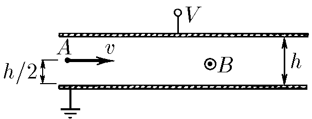

###  Statement

$10.2.8$ A plane capacitor is placed in a homogeneous magnetic field od induction $B$ parallel to the plates. From point A, electrons enter perpendicularly to magnetic field direction. The tension (voltage) applied to the plates is $V$. What is the condition for which electrons pass through the capacitor?

### Solution

Electrons pass through capacitor if they don't collide with plates. So, supposing a capacitor of infinite length, electron's velocity must be parallel to the plates (or its horizontal range over a plate greater than its enter's height). This is possible if electric and magnetic forces are in equilibrium (equal absolute values and opposed directions).

$$
evB = eE
$$

$$
v = \frac{E}{B}
$$

As $E=\frac{V}{h}$,

$$
\boxed{v = \frac{V}{Bh}}
$$

This device is known as speed's selector.