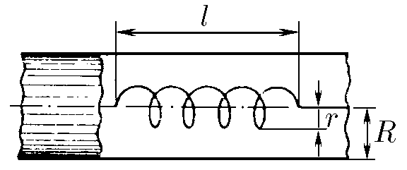
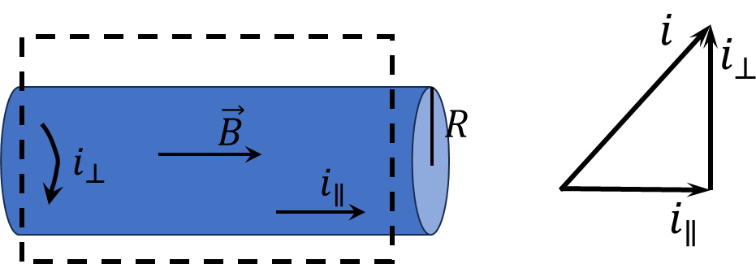
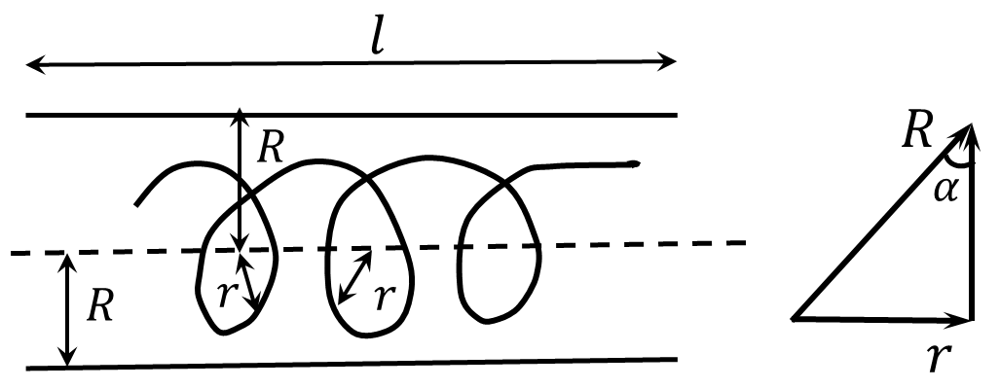

###  Statement 

$11.5.11^*.$ Calculate the inductance of a long solenoid of radius $r$ and length $l$ placed inside a long superconducting tube of radius $R$ along its axis. Number of turns of the solenoid $N$. 

  For problem $11.5.11^*$ 

### Solution

  Direction of currents inside the solenoid 

The following expressions follow from the figure $$i_\perp=i\cos\alpha$$ $$i_\parallel=i\sin\alpha$$ 

  Geometry of the solenoid 

From the geometry of the solenoid, follows the aspect ratio $$\sin\alpha = \frac{r}{R}$$ $$\cos\alpha = \sqrt{1-\frac{r^2}{R^2}}$$ Ampère's circuital law $$\oint B\,dl=\mu_0\sum_{k=1}^{N}i_k\Rightarrow B\cdot l=\mu_0 i_\perp N$$ By definition of the magnetic flux $$\left\\{\begin{matrix} \Phi=L i \\\ \Phi=NBS\cos\alpha \end{matrix}\right.$$ Equating the two equations $$L i=\mu_0 i \cos\alpha\frac{N}{l}NS\cos\alpha$$ $$L=\mu_0 \frac{N^2}{l}S\cos^2 \alpha$$ Given the formula for the area of a circle $S=\pi r^2$, we substitute the value of $\cos\alpha$ $$\boxed{L=\mu_{0}\pi r^{2}\left(1-\frac{r^{2}}{R^{2}}\right)\frac{N^{2}}{l}}$$ 

#### Answer

$$L=\mu_{0}\pi r^{2}\left(1-\frac{r^{2}}{R^{2}}\right)\frac{N^{2}}{l}$$ 
