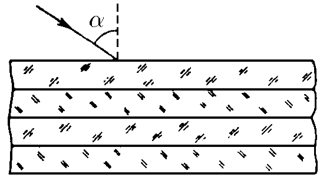
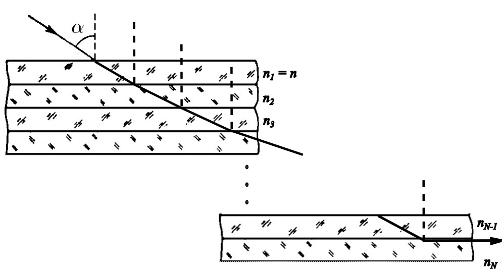

###  Statement

$13.2.11$ What minimum angle of incidence should have a light ray that incides over a group of plane transparent plates (each one with refraction index decreasing $k$ times respect to the upper to it) such that the ray doesn't pass the group? The refraction index of the upper plate is $n$ and the amount of plates is $N$.

### Solution

Let's consider the following figure

Applying Snell's law for each interphase between media

$$
n_0 \sin{\alpha} = n_1 \sin{\alpha_1} = n \sin{\alpha_1}
$$

$$
n \sin{\alpha_1} = n_2 \sin{\alpha_2}
$$

$$
n_2 \sin{\alpha_2} = n_3 \sin{\alpha_3}
$$

$$
\vdots
$$

$$
n_{N-1} \sin{\alpha_{N-1}} = n_N \sin{\frac{\pi}{2}} = n_N
$$

It's known that $n_2 = \frac{n}{k}$, $n_3 = \frac{n_2}{k}=\frac{n}{k^2}$, and so on. Then, $n_N=\frac{n}{k^{N-1}}$. The $N$-th refraction angle is $\frac{\pi}{2}$ beacause the ray doesn't pass this latest plate, i.e., there is a total reflection.

$$
n_m \sin{\alpha} = \frac{n}{k^{N-1}}
$$

If exterior medium is air, $n_m = 1$,

$$
\boxed{\sin{\alpha}=\frac{n}{k^{N-1}}}
$$

This angle $\alpha$ is the critical angle of the internal total reflection for this group of plates.