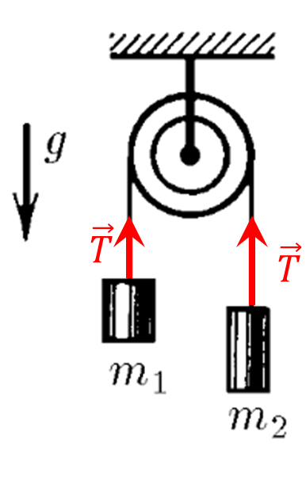

###  Statement 

$2.1.11.$ Find the acceleration of loads and tension forces of threads in the system shown in the figure. The block and threads are weightless, there is no friction. 

### Solution

  Forces acting on loads 

Let's write Newton's second law for the vertical axis $$ \left\\{\begin{matrix} m_1a = T - m_1g\\\ m_2a = m_2g - T \end{matrix}\right. $$ From here we express the acceleration, which will be the same for both loads due to the inelasticity of the thread. $$ \fbox{$a = g\frac{m_2-m_1}{m_2+m_1}$} $$ We substitute into the system of equations and find the tension force of the thread $T$ $$ \fbox{$T = \frac{2m_1m_2g}{m_1+m_2}$} $$ 

#### Answer

$$a = g\frac{m_2-m_1}{m_2+m_1}$$ $$T = \frac{2m_1m_2g}{m_1+m_2}$$
