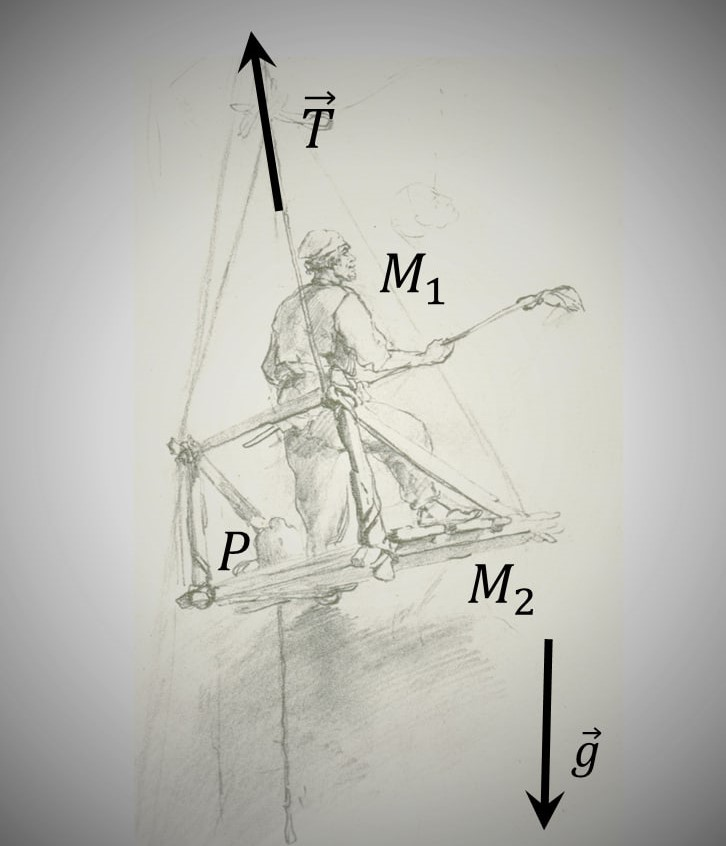

###  Statement 

$2.1.12.$ The painter works in a suspended cradle. He needed to get up quickly. He begins to pull the rope with such force that the force of his pressure on the floor of the cradle is reduced to $400$ H. Cradle weight $12$ kg, painter weight $72$ kg. What is the acceleration of the cradle? 

### Solution

Let's denote the mass of the painter as $M_1$, and the mass of the chair as $M_2$. Let's write the equations of motion of the painter and the chair: $$ \left\\{\begin{matrix} M_{1}a = T - M_{1}g + P & \\\ M_{2}a = T - M_{2}g - P & \end{matrix}\right. $$ where $P$ is the painter's pressure force on the chair. 

Subtracting the lower equation from the upper one, we find $$ a = \frac{2P - (M_{1} - M_{2})g}{M_{1} - M_{2} } = \frac{1}{3}g $$ Then adding up the equations of motion, we find $$ 2T = (M_{2} + M_{2}) (a+g) = \frac{4}{3}(M_{1} + M_{2})g = 1.1 \cdot 10^3 \,N $$ This is the full load on the block: $$ N = 2T = 1.1 \cdot 10^3 \,N $$ 

#### Answer

$$a = 3.5 \,m/s^2$$ $$T \approx 1.1 \cdot 10^3 \,N$$ 
