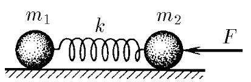
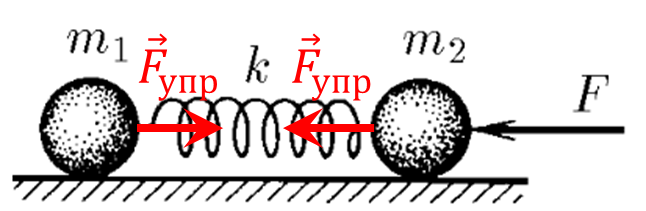

###  Statement

$2.1.14.$ Bodies of mass $m_1$ and $m_2$ are connected by a spring of stiffness $k$. A constant force $F$ acts on the body of mass $m_2$, directed along the spring to the body of mass $m_1$. Find out how much the spring is compressed, if there are no other external forces, and the vibrations have already stopped. What will be the acceleration of bodies immediately after the termination of the force $F$?

### Solution

  Forces acting on the system

When the oscillations have already stopped, the balls move with the same acceleration $a$.

Let's write Newton's second law

$$
\left\\{\begin{matrix} m_1a_1 = -k\Delta x \\\ m_2a_2 = -F + k\Delta x \end{matrix}\right.
$$

Socratic to $a$

$$
\frac{m_1}{m_2} = \frac{-k\Delta x}{-F + k\Delta x}
$$

We express $\Delta x$

$$
\boxed{\Delta x = \frac{F}{k} \frac{m_1}{m_1+m_2}}
$$

Immediately after the force ceases to act on the bodies, the elastic force $k \Delta x$ will act, which will cause acceleration

$$
\left\\{\begin{matrix} m_1a_1 = -k\Delta x \\\ m_2a_2 = k\Delta x \end{matrix}\right.
$$

Where do we express $a_1$?

$$
\boxed{a_1 = -\frac{F}{m_{2}+m_{1}}}
$$

And similarly $a_2$

$$
\boxed{a_1 = \frac{Fm_{1}}{m_{2}(m_{1}+m_{2})}}
$$

#### Answer

$$
x=-\frac{Fm_{1}}{k(m_{1}+m_{2})}
$$

$$
a_{1}=-\frac{F}{m_{2}+m_{1}}
$$

$$
a_{2}=\frac{Fm_{1}}{m_{2}(m_{1}+m_{2})}
$$