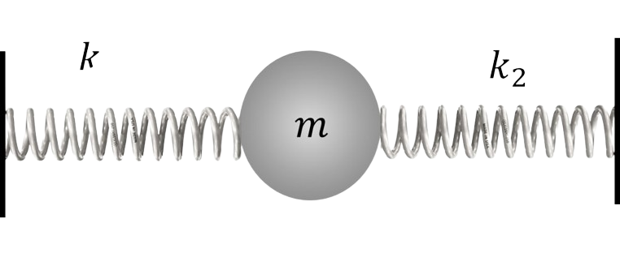
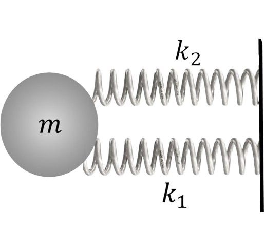

###  Statement

$2.1.15.$ The body of mass $m$ is connected by two springs of stiffness $k_1$ and $k_2$ with fixed walls, the springs are not initially deformed. When vibrations occur, the greatest acceleration of the body is $a$. Find the maximum deviation of the body from the equilibrium position and the maximum forces with which the springs act on the walls.

### Solution

1\. The springs in this problem are connected in parallel, their deformation is the same

$$
\Delta x_1 = \Delta x_2 = \Delta x
$$

2\. The force acting on the mass from the springs is determined as the sum

$$
F = F + F_1
$$

alternatively

$$
k \Delta x = k_1 \Delta x + k_2 \Delta x
$$

3\. Let us write down the equation of motion of the mass under the action of an equivalent spring with stiffness $k_0$, which will allow us to determine the maximum displacement

$$
ma = (k_1 + k_2) \Delta x_{max}
$$

$$
\Delta x_{max} = ma/(k_1 + k_2)
$$

4\. Maximum values of forces acting on the mass

$$
{F_1}_{max} = k_1 \Delta x_{max}
$$

$$
{F_2}_{max} = k_2 \Delta x_{max}
$$

#### Answer

$$
x_{max} = ma/(k_1 + k_2);
$$

$$
{F_1}_{max} = k_1x_{max}
$$

$$
{F_2}_{max} = k_2x_{max}
$$