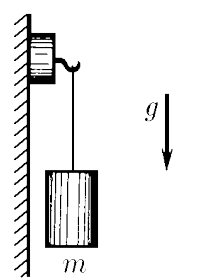
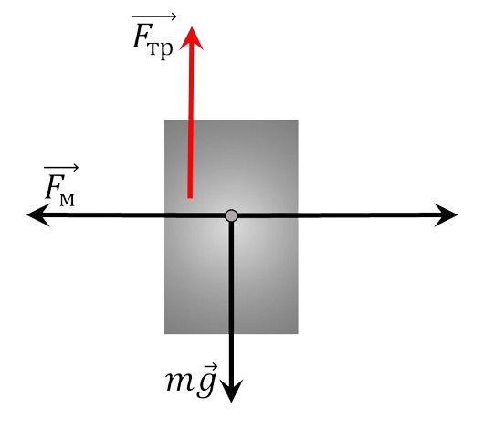

###  Statement 

$2.1.17.$ A light magnet with a hook on a vertical steel plate remains stationary as long as the weight suspended from it does not exceed $m_0$ in mass. What is the magnetic force if the coefficient of friction of the magnet on steel is equal to $\mu$? With what acceleration does the magnetic suspension slide, if the mass of the load is $m > m_0$? 

### Solution

  Forces acting on a magnet 

1\. The body can be considered as free if the connections are replaced by their reactions. The friction force in this case is caused by the action of the magnetic force, i.e. $$ F_{fr} = \mu F_m $$ 2\. The condition of mass equilibrium, in this case, will take place when the magnitudes of gravity and friction are equal. $$ m_0 g = \mu F_m\Rightarrow \boxed{F_m = \frac{gm_0}{\mu}} $$ 3\. When the body starts moving at $m > m_0$, then the equation of Newton's second law becomes valid, which in projection onto the $y$ axis will be written as follows $$ mg - m_0 g = ma $$ $$ \boxed{a = g \frac{m - m_0}{m}} $$ 

#### Answer

$$F = m_0g/\mu ;$$ $$a = g(m − m_0)/m$$ 
