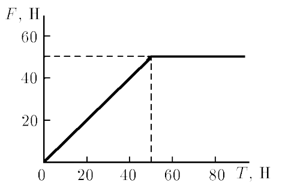

###  Statement

$2.1.18.$ A body located on a horizontal plane is pulled by the thread in the horizontal direction. Draw a graph of the dependence of the friction force acting on the body from the plane on the tension force of the thread. Initially, the body is motionless. Body weight $10\text{ kg}$, coefficient of friction $0.51$.

### Solution

1\. If a horizontal force is applied to a body, and it does not move despite efforts, then it is natural to assume that something is preventing this. And this "something" is the static friction force, equal in magnitude to the applied force. The magnitude of the static friction force can change depending on the magnitude of the applied force. The greatest value of the friction force, at which sliding does not yet occur, is determined as:

$$
F_{тp(max)} = \mu N = \mu mg = 51 \text{ N}
$$

2\. The static friction force, like any decent force, has a direction, it is directed towards the possible (virtual) movement, and at zero external force, the friction force will also be zero. Thus, the static friction force changes linearly from zero to the maximum value, remaining constant thereafter. The external force begins to impart acceleration to the body.