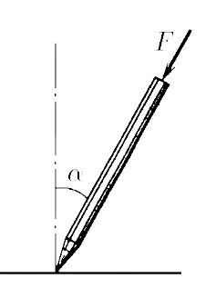
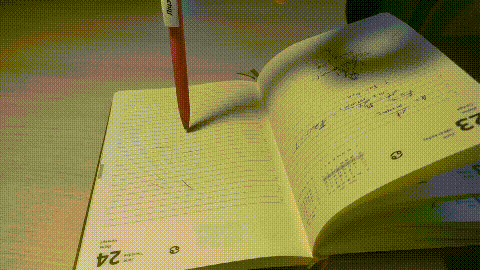

###  Statement

$2.1.19.$ If you press your finger on a ballpoint pen resting on a hard surface while simultaneously tilting it, then as long as the pen forms a small angle perpendicular to the surface, it will obediently follow the finger of the hand. As soon as the handle tilt angle exceeds a certain maximum value of $\alpha_{max}$, it will slip out from under your finger, no matter how hard or weak you press it. Experiment for yourself and estimate the coefficient of friction between the ball of the pen and the surface on which it rests.

### Solution

Let's do a visual experiment, put a pen on a piece of paper and slowly move it to the side

At some point, the pen will go in the opposite direction and slip out from under your hand

Using a special program, we will determine the angle of the pen at this moment

It worked

$$
\boxed{\alpha = 7^{\circ}}
$$

Let's display the forces acting on the handle

Since the friction force is the force of static friction

$$
F_{тр} = \mu N
$$

Let us write down the equilibrium condition at the critical moment

$$
\left\\{\begin{matrix} \mu N = F \sin\alpha\\\ N = F \cos\alpha \end{matrix}\right.
$$

Where

$$
\boxed{\mu = \tan\alpha}
$$

We substitute experimental data

$$
\mu = \tan 7^{\circ} = 0.12
$$