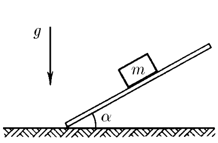
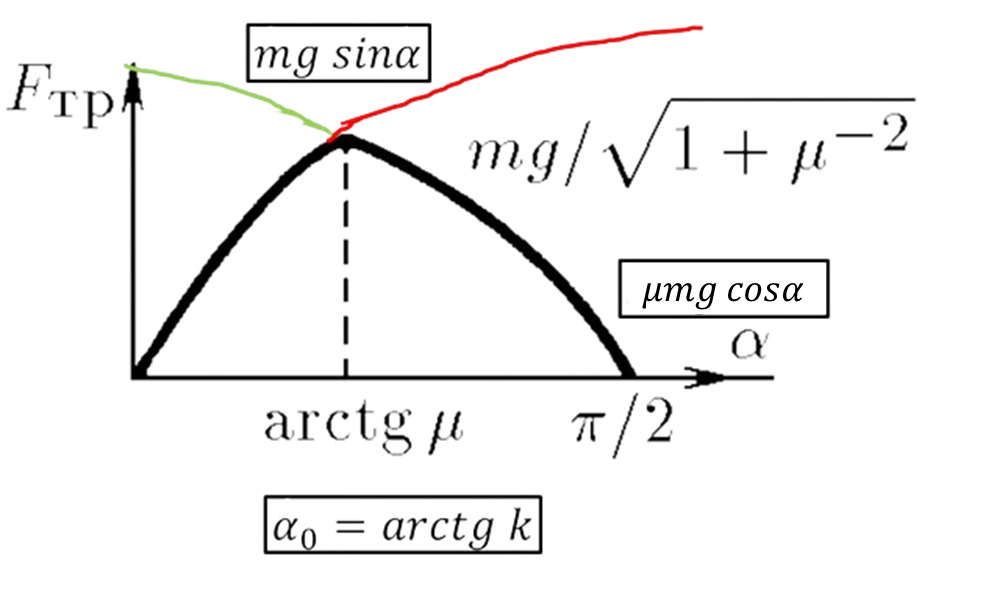

###  Statement 

$2.1.20.$ A bar of mass $m$ is placed on the horizontal board. The board is slowly tilted. Determine the dependence of the friction force acting on the bar on the angle of inclination of the board $\alpha$. Coefficient of friction $\mu$. 

### Solution

  Dependence of the friction force on the angle of the board 

1\. The friction force in magnitude cannot exceed the value $F_{fr} = \mu N$, where $N$ is the sum of the projections of all forces on the direction perpendicular to the possible movement. When the body is in equilibrium, the friction force is equal to the sum of the projections of the forces on the direction of movement. Thus, in a state of rest $$ F_{fr} = mg \sin\alpha$$ 2\. Otherwise, for $\mu\geq \tan\alpha $ $$ F_{fr} = \mu mg \cos\alpha$$ 3\. The maximum value of the friction force will occur at the angle $\alpha_0$ $$ \boxed{\alpha_0 = \arctan \mu} $$ 

#### Answer

$$F_{fr} = mg \sin\alpha\text{ with }\tan\alpha\leq \mu$$ $$F_{fr} = \mu mg \cos\alpha\text{ with }\tan\alpha\geq \mu$$ 
