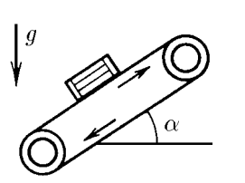

###  Statement 

$2.1.21.$ The belt lift forms an angle $\alpha$ with the horizon. With what maximum acceleration can a box be lifted on such a lift, if the coefficient of friction is equal to $\mu$? The tape doesn't bend. 

### Solution

  Forces acting on the box 

1\. By discarding the constraints imposed on the box and replacing them with reactions, we can consider it as a free body capable of moving along the $OX$ axis. The friction force in this case is directed toward acceleration, i.e. against the possible movement of the box. 

2\. The equation of Newton's second law allows us to determine the maximum value of acceleration $$ \mu mg \cos\alpha -mg \sin\alpha\leq ma $$ $$ \boxed{a \leq g (\mu\cos\alpha -\sin\alpha )} $$ 

#### Answer

$$a_{max} = g(\mu\cos\alpha − \sin\alpha )$$ 
