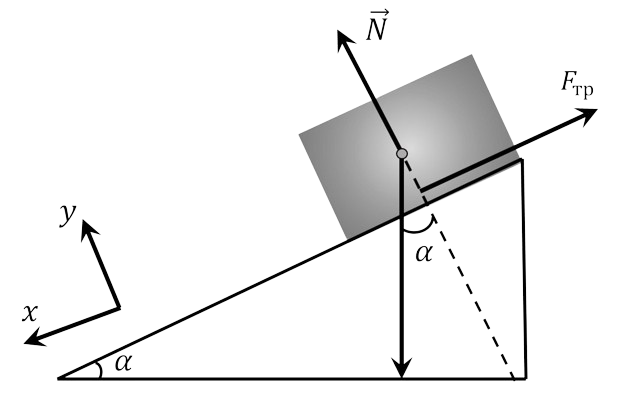

###  Statement

$2.1.22.$ After what time will the velocity of a body that has been sent up an inclined plane with velocity $v$ be equal to $v$ again? Coefficient of friction $\mu$, the angle between the plane and the horizon $\alpha$, $\tan\alpha > \mu$.

### Solution

The body on the inclined plane is under the action of three forces: the force of gravity $\vec{F}_{1} = m \vec{g}$, the force of friction $\vec{F}_{2} = - \mu mg$ and the normal reaction of the constraint $\vec{N}$, however, when further considering the motion, the normal reaction can be ignored, since its projection onto the horizontal axis along which the body moves is equal to zero.

The equation of Newton's second law in projection onto the OX axis when the body moves upward in vector form is written as follows

$$
\vec{F}_{1} + \vec{F}_{2} = m \vec{a}
$$

Let us determine the projections of the acting forces on the OX axis and write down the equation of Newton's second law

$$
F_{1x} = mg \sin\alpha , F_{2x} = \mu mg \cos\alpha
$$

$$
\mu mg \cos\alpha + mg \sin\alpha = ma
$$

We divide both parts of the last equation by the mass $m$ and express the magnitude of the acceleration

$$
a = g( \sin\alpha + \mu\cos\alpha )
$$

The time of the body's upward movement $t_1$ is determined from the condition that the speed at the end of the ascent is equal to zero

$$
0 = v_{0} - at \Rightarrow t_{1} = \frac{v_{0} }{a} = \frac{v_{0} }{g ( \sin\alpha + \mu\cos\alpha ) }
$$

The downward motion of the body corresponds to the equation

$$
mg \sin\alpha - \mu mg \cos\alpha = ma
$$

$$
a = g( \sin\alpha - \mu\cos\alpha )
$$

The speed will become equal to $v_0$ only at the end of the descent, because the law of conservation of energy has not been repealed, therefore

$$
\frac{dv}{dt} = g( \sin\alpha + \mu\cos\alpha )
$$

$$
\int_{0}^{v_{0} } dv = g( \sin\alpha + \mu\cos\alpha ) = \int_{0}^{t_{2} } dt
$$

$$
t_{2} = \frac{v_{0} }{g ( \sin\alpha + \mu\cos\alpha ) }
$$

The required time will be determined as the sum $t = t_{1} + t_{2}$

$$
\boxed{t = \frac{2v_{0} \sin\alpha}{g( \sin^{2} \alpha - \mu^{2} \cos^{2} \alpha )}}
$$

#### Answer

$$
t = \frac{2v_{0} \sin\alpha}{g( \sin^{2} \alpha - \mu^{2} \cos^{2} \alpha )}
$$