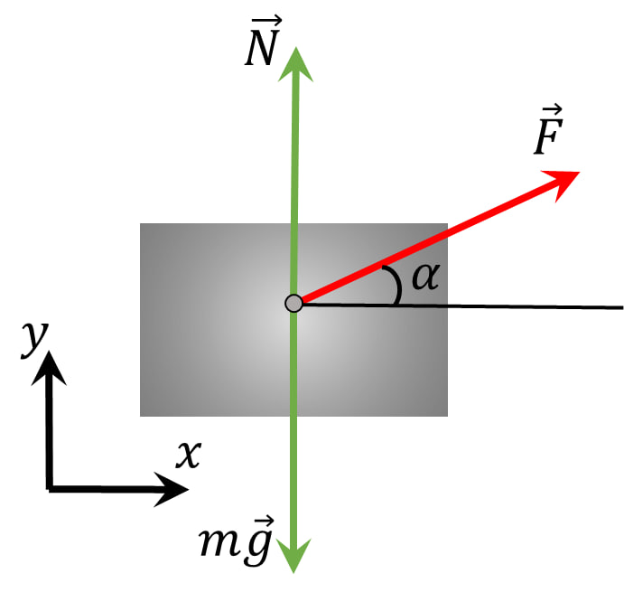

###  Statement 

$2.1.23.$ A body of mass $m$ lying on a horizontal plane is affected by a force $F$ at an angle $\alpha$ to the horizon. Coefficient of friction $\mu$. Find the acceleration of the body if it does not detach from the plane. 

### Solution

1\. The normal reaction of the connection in this case will be determined both by the force of gravity $mg$ and the projection on the axis $OY$ of the applied force: 

$$N=mg-F \sin\alpha$$ 

The friction force is determined as: 

$$F_{fr} = (mg-F \sin\alpha )$$ 

2\. The basic law of dynamics, therefore. will be written as follows: 

$$F \cos\alpha = \mu (mg-F \sin\alpha )$$ 

3\. From the equation of Newton's second law it is easy to determine the desired acceleration 

$$a = \frac{1}{m}(F\cos\alpha -\mu mg+F\sin\alpha )$$ 

$$a = \frac{F}{m}(\cos\alpha -\mu\sin\alpha )$$ 

#### Answer

$a = (F/m)(\cos\alpha + \mu\sin\varphi)$$ − \mu g$ if this expression is greater than zero, otherwise $a = 0$. 
