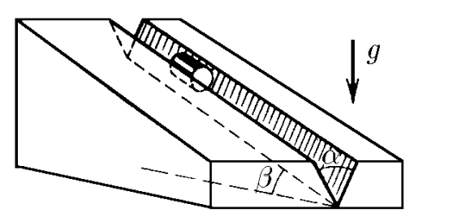
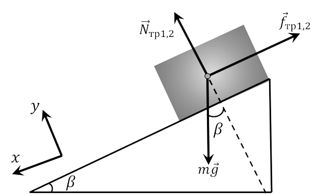

###  Statement

$2.1.24.$ The cylinder slides along the chute, which has the form of a dihedral angle with the solution $\alpha$. The edge of a dihedral angle is inclined at an angle $\beta$ to the horizon. The planes of a dihedral angle form identical angles with the horizon. Determine the acceleration of the cylinder. Coefficient of friction between the cylinder and the chute surface $\mu$.

### Solution

Forces acting on the cylinder: gravity $\vec{F}_{т} = m \vec{g}$ two forces of normal reaction of the faces of the dihedral angle $\vec{N}_{1}$ and $\vec{N}_{2}$, two forces of friction of the cylinder on the faces $\vec{f}_{fr1}$ and $\vec{f}_{fr2}$ (see pictures). Since the cylinder has axial symmetry and the planes of the dihedral angle are symmetrical with respect to the vertical

$$
| \vec{N}_{1} | = | \vec{N}_{2} | = N
$$

$$
\vec{f}_{fr1}| = | \vec{f}_{fr2} | = f_{fr}
$$

According to the Coulomb-Amonton law $f_{tr} = \mu N$.

The fundamental law of dynamics for a cylinder is

$$
m \vec{a} = m \vec{g} + \vec{N}_{1} + \vec{N}_{2} + \vec{f}_{fr1} + \vec{f}_{fr2}
$$

Since the cylinder is stationary in the plane of the section perpendicular to the edge of the dihedral angle, then projecting this equation onto the axis perpendicular to the edge, we obtain (see figure b)

$$
2N \sin\frac{ \alpha}{2} = mg \cos\beta
$$

In projection onto the edge (axis $OX$) the dynamic equation for the cylinder is written as

$$
ma_{x} = mg \sin\beta - 2N \mu
$$

Substituting $N$ here, we find the acceleration of the cylinder

$$
a_{x} = g \left ( \sin\beta - \frac{ \mu\cos\beta}{ \sin\alpha / 2} \right )
$$

#### Answer

$$
a=g\left(\operatorname{sin}\beta -\frac{\mu\operatorname{cos}\beta}{\operatorname{sin}(\alpha /2)}\right)\text{ with }\mu\leqslant\operatorname{tg}\beta\operatorname{sin}\frac{\alpha}{2};
$$

$$
a=0\text{ with }\mu\geqslant\operatorname{tg}\beta\operatorname{sin}\frac{\alpha}{2}.
$$