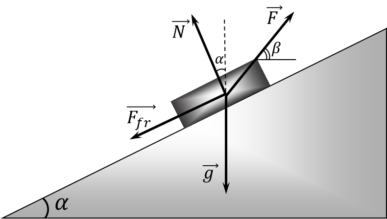
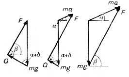

###  Statement 

$2.1.26^*.$ On the wooden gangplank forming an angle $\alpha$ with the horizon, a box is dragged by a rope tied to it. Coefficient of friction of the box on the gangway $\mu$. At what angle to the horizon should the rope be pulled in order to pull the box with the least effort? 

### Solution

Let's consider the forces acting on the box (Fig.). These are the force of gravity $ m \vec{g} $, the tension force of the rope $ \vec{F} $, the reaction force of the collision $ \vec{N} $ and the friction force $ \vec{F}_{пт} $, the magnitude of which $ \vec{F}_{пт} = \mu N $. Let's project all the forces in the direction along the convergence and perpendicular to them and write down the corresponding equations of motion.

Since the box does not move in the direction perpendicular to the convergence, the sum of the projections of the forces in this direction must be equal to zero, that is,

\\[ N + F \sin ( \beta - \alpha ) - mg \cos\alpha = 0, \tag{1} \\] 

Along the convergence, the box moves with acceleration $ a $ (in the special case of uniform motion $ a = 0 $), therefore the sum of the projections of the forces must be equal to $ ma $:

\\[ F \cos( \beta - \alpha ) - mg \sin\alpha - \mu N = ma. \tag{2} \\] 

From equations (1) and (2) we obtain:

\\[ F = \frac{ma + mg ( \sin\alpha + \mu\cos\alpha )}{ \cos ( \beta - \alpha ) + \mu\sin ( \beta - \alpha ) }. \tag{3} \\] 

Only the denominator of the angle $ \beta$ is included in the obtained expression for the force $ F $. Consequently, the magnitude of the force $ F $ will be minimal at such a value of the angle $ \beta$, at which the denominator in formula (3) is maximal, that is, the magnitude is maximal

\\[ \cos ( \beta - \alpha ) + \mu\sin ( \beta - \alpha ). \\] 

Let's make some transformations. Let's represent the coefficient of friction $ \mu$ as the tangent of some angle $ \gamma$:

\\[ \tan\gamma = \mu ; \quad \gamma = \arctan \mu ; \\] \\[ \sin\gamma = \frac{ \mu}{ \sqrt{1 + \mu^{2} } }; \quad \cos\gamma = \frac{1}{ \sqrt{1 + \mu^{2} } }. \\] 

Then we can write:

\\[ \cos ( \beta - \alpha ) + \mu\sin ( \beta - \alpha ) = \sqrt{1 + \mu^{2} } \cos ( \beta - \alpha - \gamma ). \\] 

The last expression is maximal and equals

\\[ \sqrt{1 + \mu^{2}} \quad \text{at} \quad \beta - \alpha - \gamma = 0, \quad \text{that is, at} \quad \beta = \alpha + \gamma = \alpha + \arctan \mu . \tag{4} \\] 

At this value of the angle $ \beta$, the force $ F $ is minimal. Moreover, if the box moves uniformly ($ a = 0 $), then

\\[ F_{min} = \frac{mg( \sin\alpha + \mu\cos\alpha ) }{ \sqrt{1 + \mu^{2} } }. \\] 

and when moving with acceleration $ a $

\\[ F_{min} = \frac{ma + mg ( \sin\alpha + \mu\cos\alpha ) }{ \sqrt{1 + \mu^{2} } }. \\] 

However, this solution is not true for any acceleration. Since the direction of the force $ \vec{F} $ does not depend on $a$, and the absolute value of the force $ \vec{F} $ increases with increasing acceleration, then at some value of acceleration $ a = a_0 $ the force $ \vec{F} $ will be such that its component $ F \sin (\beta - \alpha ) $, perpendicular to the inclined plane, will be equal in absolute value to the component of the force of gravity $ mg \cos\alpha$. In this case, both the force $ \vec{N} $ and the force $ \vec{F}_{tr} $ will vanish. In the future (for $ a > a_0 $), in order for the box not to come off the runners, the direction of the force $ \vec{F} $ must change with increasing acceleration so that the component of the force $ \vec{F} $ perpendicular to the inclined plane remains equal to the component of the force of gravity, that is, \\[ F \sin (\beta - \alpha ) = mg \cos\alpha\\] For the components of these forces parallel to the inclined plane, we can write \\[ F \cos (\beta - \alpha ) - mg \sin\alpha = ma \\] From the last two equalities, we find \\[ \tan (\beta - \alpha ) = \frac{g \cos\alpha}{g \sin\alpha + a} \\] whence \\[ \beta = \alpha + \arctan \frac{g \cos\alpha}{g \sin\alpha + a} \\] The value of $ a_0 $ can be found from the fact that for $ a = a_0 $ the values ​​of the angle $ \beta$ from (4) and (5) coincide: \\[ \alpha + \arctan \frac{g \cos\alpha}{g \sin\alpha + a_0 } = \alpha + \arctan \mu\\] whence \\[ a_0 = g \left( \frac{\cos\alpha}{\mu} - \sin\alpha\right) \\] Thus, for $ a \leq a_0 $ (and therefore for uniform motion too) \\[ \beta = \alpha + \arctan \mu\\] For $ a > a_0 $ \\[ \beta = \alpha + \arctan \frac{g \cos\alpha}{g \sin\alpha + a} \\] We have solved the problem. However, we will give another solution. This is a beautiful geometric solution. For uniform motion along the slope, the sum of all forces must be zero. We will replace the forces $ \vec{N} $ and $ \vec{F}_{пт} $ with their resultant $ \vec{Q} = \vec{N} + \vec{F}_{пт} $ (Fig.) and add the forces $ \vec{Q}, \vec{F} $ and $ m \vec{g} $. They must form a closed triangle. Let us replace that the direction of the force $ \vec{Q} $ makes an angle $ \delta$ with the perpendicular to the inclined plane such that \\[ \tan\delta = \frac{F_{тре}}{N} = \frac{\mu N}{N} = \mu\\] 

 

Thus, when the magnitude and direction of the force $ \vec{F} $ change, the direction of the force $ \vec{Q} $ remains unchanged. Consequently, the absolute value of the force $ \vec{F} $ will be minimal if it is perpendicular to the vector $ \vec{Q} $ (Fig.). (since the magnitude and direction of the vector $ m \vec{g} $ are constant), then the minimum force will be equal to: \\[ F_{\min} = mg \sin\alpha + mg \mu\cos\alpha = mg (\sin\alpha + \mu\cos\alpha ) \\] Thus, the value of the minimum force required to lift the box with acceleration $ a \leq a_0 $ is equal to \\[ F_{\min} = mg (\sin\alpha + \mu\cos\alpha ) \\] If the acceleration $ a > a_0 $, then for the minimum force $ \vec{F} $ directed at an angle $ \beta$ to the horizontal, we have: \\[ \beta = \alpha + \arctan \frac{g \cos\alpha}{g \sin\alpha + a} \\]

#### Answer

$$\beta = \alpha + \arctan \mu$$ 
