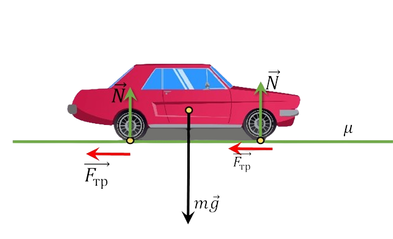

###  Statement

$2.1.28.$ On an icy section of the highway, the coefficient of friction between the wheels and the road is ten times less than on an un-icy one. How many times do you need to reduce the speed of the car so that the braking distance on an icy section of the highway remains the same?

### Solution

1\. The external force when the car is moving is the friction force $F = \mu mg$, therefore, without taking into account the resistance from the air, the dynamic equation of motion has the form

$$
ma = \mu mg
$$

$$
a = \mu g
$$

2\. The kinematic equations of motion in this case are represented as follows:

$$
\left\\{\begin{matrix} v = v_0-at \\\ x=v_0-\frac{at^2}{2} \end{matrix}\right.
$$

$$
t=\frac{v_0}{a}=\frac{v_0}{\mu g}
$$

3\. When substituting the values ​​of acceleration and time into the second equation, we obtain the equation for the braking distance of a car

$$
x=\frac{v_0^2}{\mu g}-\frac{v_0^2}{2\mu g}=\frac{v_0^2}{2\mu g}
$$

$$
v_0 = \sqrt{2\mu gx}
$$

Hence the speed needs to be reduced by $\sqrt{10}$ times

#### Answer: $\sqrt{10}$ times