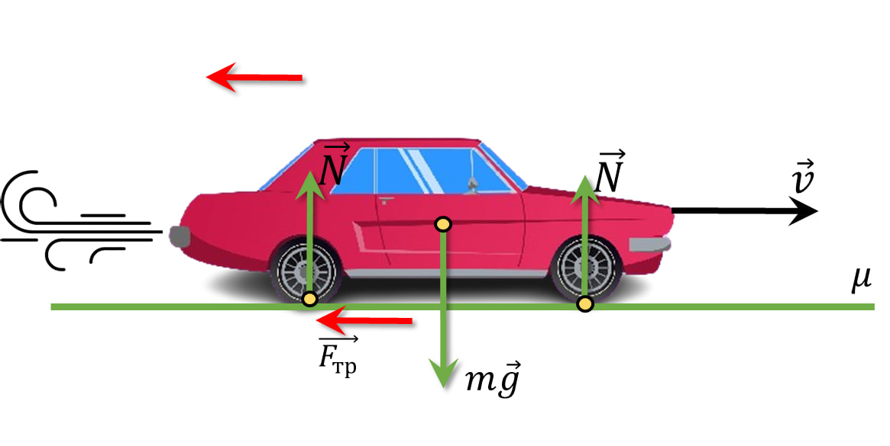

###  Statement

$2.1.29.$ A car with a powerful engine, starting from a place, gains a speed of $72\text{ km/h}$ in $5$ seconds. Find the coefficient of friction between the wheels and the road. What is the shortest braking distance of a car that has reached this speed?

### Solution

a 

Finding the deceleration value

$$
a = -\frac{\Delta v}{\Delta t} = -4 ~\mathrm{\frac{m}{s}}
$$

$$
\Delta t = \frac{\Delta v}{a}
$$

2\. The kinematic equations of motion in this case are represented as follows:

$$
\boxed{x=v_0t-\frac{v \Delta t^2}{2}=\frac{v_0^2}{2a}=50 \text{ m}}
$$

Let's find the coefficient of friction $\mu$:

$$
ma = \mu mg
$$

$$
\boxed{\mu = \frac{a}{g} = 0.4}
$$

#### Answer

$$
\mu\approx 0.4;\quad l \approx 50 \text{ m}
$$