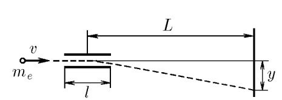

###  Statement 

$2.1.3.$ In a cathode-ray tube, electrons with an initial horizontal velocity $v$ fly into the region of an electric field of length $l$, where they are affected by a vertical force from charged deflecting plates. What is this force equal to if the electrons hitting the screen are displaced by a distance $y$ compared to the case of uncharged plates? The screen is located at a distance $L$ from the center of the area of action of the electric force. The mass of the electron is $m_e$. 

### Solution

The electric force gives the electron acceleration $$ a = \frac{F_{el}}{m_e} $$ where $a = \frac{v_y – v_{0y}}{t}\text{, since }v_{0y} = 0$ – the electron flies in perpendicular to the screen, then $$ \frac{v_y}{t} = \frac{F_{el}}{m_e};\quad F_{el} = \frac{m_ev_y}{t}\; (1) $$ Here $v_y$ is the vertical component of the velocity that the electron acquires when it leaves the plates. To determine the electric force, it is necessary to find the vertical velocity and the time of movement of the electron before leaving the plates. We will determine the velocity from the condition $$ y = \frac{at^2}{2} = \frac{v_y t^2}{2t} = \frac{v_y t}{2}, $$ $$ v_y = \frac{2y}{t}\text{, where }t = \frac{l}{v},\; (2) $$ therefore, the vertical component of the velocity $$ v_y = \frac{2yv}{l}\; (3) $$ Substituting (2) and (3) into (1), we obtain $$ F_{el} = \frac{2ym_ev^2}{l^2}\; (4) $$ After leaving the plates, the electron continues to move by inertia. The tangent of the angle at which the electron flies to the horizontal after leaving the plates is equal to $$ \tan\alpha = \frac{v_y}{v} = \frac{2y}{vt} = \frac{2y}{l} $$ On the other side $$ \tan\alpha = \frac{Y - y}{L – l/2} = \frac{2(Y - y)}{2L - l} $$ Then $$ \frac{2y}{l} = \frac{2(Y - y)}{2L - l} $$ After simple transformations we find $$ y = \frac{Yl}{2L}.\; (5) $$ Let's substitute (5) into (4) and find the answer to the question $$ F_{el} = \frac{2m_ev^2}{l^2}\frac{Yl}{2L} = \frac{m_eYv^2}{lL} $$ 

#### Answer

$$F_{el} = \frac{m_eYv^2}{lL}$$ 
