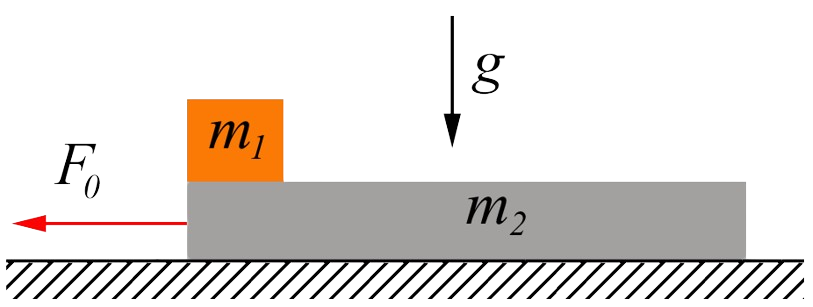

###  Statement 

$2.1.30^*.$ A body of mass $m_1$ lies on a board of mass $m_2$ located on a smooth horizontal plane. Coefficient of friction between the body and the board $\mu$. 
a. What force should be applied to the board so that the body slides off it? How long will it take for a body to slide if a force $F_0$ is applied to the board and the length of the board is $l$? 
b. With what acceleration do the body and board move if the force $F_0$ acts on the body of mass $m_1$?

### Solution

$a)$ For a body to start sliding, the applied force must exceed the friction force. When determining the magnitude of the friction force, it is necessary to take into account that, in accordance with Newton's third law, the body acts on the board, and the board on the body, so a double friction force will be exerted $$ F_t = \mu g (m_1 + m_2) $$ Condition for starting movement: $$ \boxed{F > \mu g (m_1 + m_2)} $$ To determine the sliding time, we use kinematic equations: $$ l = \frac{a t^2}{2} \Rightarrow t = \sqrt{\frac{2L}{a}} $$ The acceleration a when a constant force $F_0$ acts along the board is determined from the equation of Newton's second law in projection onto the direction of motion: $$ F_0 - F_t = m_1 a $$ $$ a = \frac{F_0 - \mu g (m_1 + m_2)}{m_1} $$ Sliding time: $$ \boxed{t = \sqrt{\frac{2 L m_1}{F_0 - \mu g (m_1 + m_2)}}} $$ 

$b)$ The body is acted upon by two external forces $F_0$ and the friction force $F_{tr}$. Let us write down Newton's second law for the body $$ m_1a_1 = F_0 - F_{тр} $$ Considering that $$ F_{тр} = \mu N = \mu m_1 g $$ $$ m_1a_1 = F_0 - \mu m_1 g $$ Where $a_1$ we find as $$ \boxed{a_1 = \frac{F_0 - \mu m_1 g}{m_1}} $$ Meanwhile, of the external forces, only the friction force with the block acts on the board 

Then Newton's second law for the board $$ m_2a_2 = \mu m_1 g $$ We express $a_2$ $$ \boxed{a_{2}=\mu g\frac{m_{1}}{m_{2}}} $$ 

#### Answer

a. $F>\mu (m_{2}+m_{1})g,\quad t=\sqrt{\frac{2lm_{2}}{F_{0}-\mu (m_{2}+m_{1})g}}$

b. $ a_{1}=\frac{F_{0}-\mu m_{1}g}{m_{1}},\quad a_{2}=\mu g\frac{m_{1}}{m_{2}}.$
