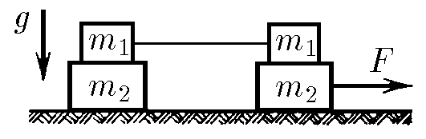
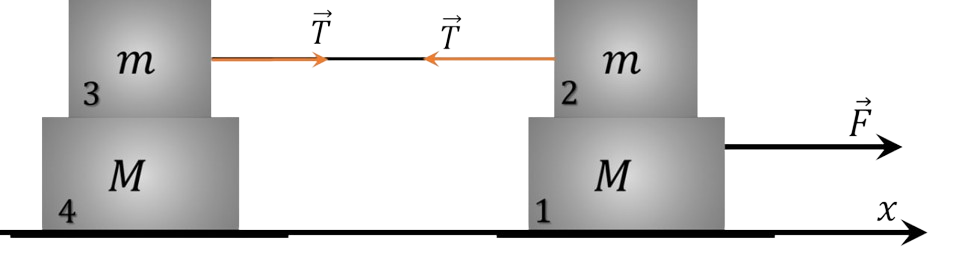

###  Statement 

$2.1.31.$ The cargo system shown in the figure is located on a smooth horizontal table. The lower right weight is pulled along the table with a force of $F$, as indicated in the figure. The coefficient of friction between loads of mass $m_1$ and $m_2$ is equal to $\mu$. Find the acceleration of all loads in the system. 

### Solution

Let's renumber the weights as shown in the figure, and direct the $X$ axis to the right. 

It is clear that then none of the weights can have negative acceleration. 

Let's prove that weights $3$ and $4$ move as a single whole. To do this, let's assume the opposite: let weight $3$ slide on weight $4$. Then a friction force arises between them $$ F_{fr}= \mu mg $$ and elastic force arises in the thread $$ T> \mu mg $$ In this case, the acceleration of load $2$ would be directed to the left, which is impossible. Therefore, the accelerations of loads $2$, $3$, and $4$ are the same. 

Let us denote the acceleration of these loads as $\bar{a}_{1}=\bar{a}_{2}$, and the acceleration of load $1$ as $\bar{a}_{1}$. 

Now consider two cases. 

Case 1. Let loads $1$ and $2$ be at relative rest and $\bar{a}_{1}=\bar{a}_{2}$. 

Let us denote the modulus of the static friction force between them as $F_1$, the modulus of the friction force between loads $3$ and $4$ as $F_2$, and the modulus of the elastic force of the thread as $T$ . 

Then: for cargo $1$ $$ F-F_{1}=Ma_{1} $$ for cargo $2$ $$ F_{1}-T=ma_{2} $$ for cargo $3$ $$ T-F_{2}=ma_{2} $$ for cargo $4$ $$ F_{2}=Ma_{2} $$ Solving this system of equations, we obtain: $$ F_{1}=\frac{2m+M}{2(M+m)}F,a_{1}=a_{2}=\frac{F}{2(M+m)} $$ The same result can be obtained in another way. Since the friction between all surfaces is static friction, the system of loads moves as one body with mass $M=2(M+m)$. 

Therefore $$ \bar{F}=m \bar{a}_{1},\bar{a}_{1}=\bar{a}_{2}= \frac{\bar{F}}{2(M+m)} $$ Case $2$. 

Let load $2$ slide on load $1$. Then the friction force acts on load $1$ $$ F_{fr}^{\prime}= \mu mg $$ and this load receives acceleration $a_{1}=\frac{F- \mu mg}{m}$. 

The system of loads $2$, $3$ and $4$ moves as one body, the mass of which is $M_{0}=2m+M$ with acceleration $$ a_{2}=\frac{\mu mg}{2m+M} $$ The first case is realized if $$ F \geq \frac{2 \mu m (m+M)g}{2m+M} $$ 

#### Answer

For $F\leqslant\frac{2\mu m_{1}g(m_{1}+m_{2})}{m_{2}+2m_{1}}\equiv F_{0}$ we get $a_{1\text{sing}}=a_{1\text{right}}=a_{2\text{right}}=\frac{F}{2(m_{1}+m_{2})}$ 

For $F\geqslant F_{0}$ we get $a_{2\text{right}}=\frac{F-\mu m_{1}g}{m_{2}}$, $a_{1\text{left}}=a_{1\text{right}}=a_{2\text{left}}=\frac{\mu m_{1}g}{m_{2}+2m_{1}}$ 
