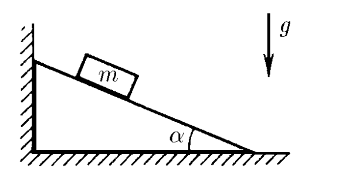
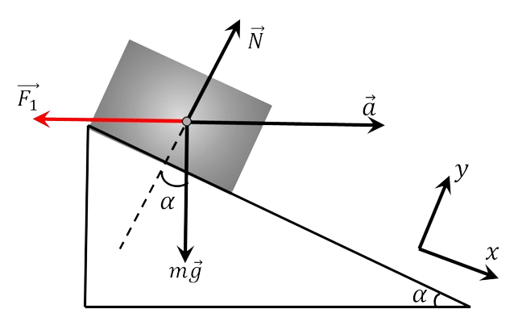

###  Statement 

$2.1.32.$ Determine the force acting on the vertical wall from the side of the wedge, if a weight of mass $m$ is placed on it. Angle at the base of the wedge $\alpha$. Coefficient of friction between the load and the wedge surface $\mu$. There is no friction between the floor and the wedge. 

### Solution

  Forces acting on the load 

The occurrence of an action on the wedge from the chalk is due to the accelerated movement of the body along the wedge 

The movement becomes possible under the condition $$ mg \sin\alpha\geq \mu mg \cos\alpha$$ otherwise, the body will be at rest, and acceleration will not occur. 

Using the principles of liberation, we will represent the body as a free material particle under the action of a system of forces $\\{mg; F_\tau\\}$ 

The equation of Newton's second law in projection onto the direction of motion of the body will be represented as follows: $$ ma_x=mg \sin\alpha - \mu mg \cos\alpha$$ $$ a_x=g \sin\alpha - \mu g \cos\alpha$$ Force acting on the wedge and the vertical wall $$ F = mg \cos\alpha (\sin\alpha - \mu\cos\alpha ) $$ 

#### Answer

$F=mg\operatorname{\cos}\alpha (\operatorname{sin}\alpha -\mu\operatorname{\cos}\alpha )$ with $\mu\leqslant\operatorname{tg}\alpha$; 

$F=0$ with $\mu\geqslant\operatorname{tg}\alpha$ 
