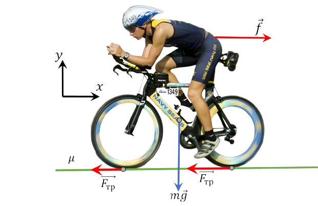

###  Statement 

$2.1.34.$ The air resistance force acting on the cyclist is proportional to the square of the cyclist's speed: $f = \alpha v^2$ On a horizontal road, the maximum speed of a cyclist is approximately $20$ $\frac{m}{s}$. Estimate the proportionality coefficient $\alpha$ if the mass of the cyclist together with the bike is $70$ kg, and the coefficient of friction between the wheels and the road is $0.4$. 

### Solution

In this case, the movement occurs exclusively due to the friction force, which, in fact, is the driving force. If there were no friction force, then the bicycle, as well as the car, would not move. Movement with acceleration becomes possible when the projection of the friction force on the horizontal axis exceeds the resistance force from the air in magnitude $$ \mu mg \geq f $$ When moving without acceleration, at a constant speed, the last inequality turns into an equality $$ \mu mg = f $$ $$ \mu mg = \alpha v^2 $$ $$ \boxed{\alpha = \frac{\mu mg}{v^2}\approx 0.7~\text{kg/m}} $$ 

#### Answer

$$\alpha\approx 0.7~\text{kg/m}$$ 
