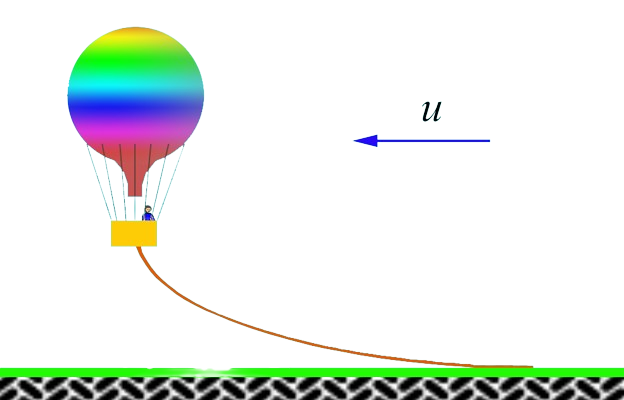

###  Statement

$2.1.35^*.$ The mass of the balloon together with the rope dragging along the ground is $m$; the buoyant force acting on the balloon is $F$; the coefficient of friction of the rope on the ground is $\mu$. The air resistance force acting on the balloon is proportional to the square of the balloon's velocity relative to the air: $f = \alpha v^2$. Find the velocity of the balloon relative to the ground if a horizontal wind is blowing with a velocity of $u$.

### Solution

There are five forces acting on the balloon (see fig.): gravity $\vec{F}_{т} = M \vec{g}$, buoyancy $\vec{F}$, air resistance $\vec{F}_{c}$, Earth reaction force $\vec{N}$ and Earth friction force $\vec{F}_{пт}$.

Let $\vec{v}^{ \prime}$ denote the velocity of the balloon relative to the Earth. Then

$$
\vec{F}_{c} = - \alpha ( \vec{v}^{ \prime} - \vec{u})
$$

From the condition that the balloon moves uniformly in the horizontal direction, it follows

$$
| \vec{F}_{c} | - | \vec{F}_{тр} | = 0
$$

$$
| \vec{F}| + | \vec{N}| - M | \vec{g} | = 0
$$

Besides,

$$
| \vec{F}_{тр} | = \mu | \vec{N} |
$$

Taking into account that

$$
| \vec{F}_{c}| = - \alpha ( | \vec{v}^{ \prime} | - | \vec{u} | )
$$

from the last three equations we get

$$
| \vec{v}^{ \prime} | = | \vec{u} | - \frac{ \mu}{ \alpha} (M | \vec{g} | - | \vec{F} | )
$$

#### Answer

$v = u − \sqrt{(\mu /\alpha )(mg − F)}$ at $\alpha u^2 \geq \mu (mg − F)$, otherwise $v = 0$