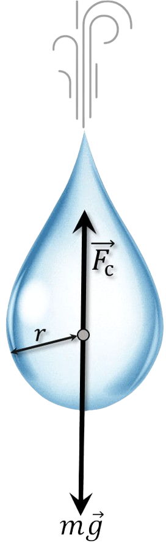

###  Statement

$2.1.37.$ The force of air resistance acting on raindrops is proportional to the product of the square of the droplet velocity and the square of their radius: $f = A \rho_0 r^2 v^2$, where $\rho_0 \approx 1.3$ $\frac{kg}{m^3}$ is the air density, and the dimensionless coefficient A for round drops is of the order of $1$. Which drops, large or small, fall to the ground with faster speed? Estimate the velocity of a drop of radius $r = 1$ mm when it falls from a great height.

### Solution

There are two forces acting on a falling drop: the constant force of gravity, which accelerates the movement of the drop, and the force of air resistance, which slows its movement and increases with the speed of the drop. The force of air resistance increases until it becomes equal to the force of gravity. Then the change in speed stops, and the drop falls at a constant speed.

Let's write the equation after a long period of time:

$$
mg=A\rho_0r^2v^2\tag{1}
$$

Let's find $m$ through the volume $V$:

$$
m=\rho V=\frac{4}{3} \rho\pi r^3
$$

And we substitute into $(1)$:

$$
\frac{4}{3} \rho\pi r^3 g=A\rho_0r^2v^2
$$

From here:

$$
\boxed{v = \sqrt{\frac{4}{3} \rho\pi r g \cdot \frac{1}{A\rho_0}}\approx 5.5\,\frac{\text{m}}{\text{s}}}\tag{2}
$$

From $(2)$, the larger $r$, the larger $v$. This means that larger drops fall to the ground at a higher speed

#### Answer

Large; $v \approx 5.5 ~\text{m/s}$