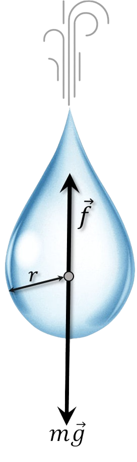

###  Statement 

$2.1.38.$ The air resistance force acting on fog drops is proportional to the product of the radius and velocity: $f = \gamma rv$. Drops of radius $r = 0.1$ mm, falling from a great height, have a speed of about $1$ $\frac{m}{s}$ near the ground. What speed will drops have if their radius is half as large? ten times less? 

### Solution

A falling drop is acted upon by two forces: the constant force of gravity, accelerating the drop's movement, and the force of air resistance, slowing its movement and increasing with the drop's speed. The force of air resistance increases until it becomes equal to the force of gravity. Then the speed stops changing, and the drop falls at a constant speed. 

Let's write the equation after a long period of time: $$ mg=\gamma rv\quad(1) $$ Let's find $m$ through the volume $V$: $$ m=\rho V=\frac{4}{3} \rho\pi r^3 $$ And we substitute into $(1)$: $$ \frac{4}{3} \rho\pi r^3 g=\gamma rv $$ From here: $$ v = \frac{4}{3} \frac{\rho\pi g}{\gamma} \cdot r^2 =\alpha r^2\quad(2) $$ $$ \alpha = \frac{4}{3} \frac{\rho\pi g}{\gamma} =\frac{v}{r^2}=10^8 \,\frac{1}{\text{m}\cdot\text{s}} $$ We substitute and find the answer $$ v(\frac{r}{2}) = \alpha\frac{r^2}{4}=0.25~\text{m/s} $$ $$ v(\frac{r}{10}) = \alpha\frac{r^2}{100}=0.01~\text{m/s} $$ 

#### Answer

$$v_1 \approx 0.25 ~\text{m/s}$$ $$v_2 \approx 0.01 ~\text{m/s}$$ 
