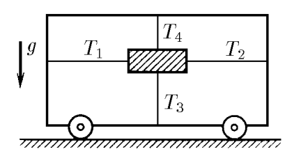
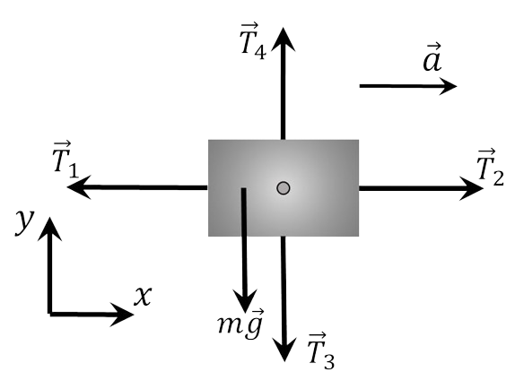

###  Statement 

$2.1.4.$ The load is secured to the cart by four strung threads. The tension force of horizontal threads is $T_1$ and $T_2$, respectively, and that of vertical threads is $T_3$ and $T_4$. How fast does the cart move along the horizontal plane? 

### Solution

  Forces acting on the load 

Newton's second law: $$ \vec{T_1} + \vec{T_2} + \vec{T_3} + \vec{T_4} + m\vec{g}=m\vec{a} $$ Let us write the system of equations in projections onto the $Ox$ and $Oy$ axes: $$ \left\\{\begin{matrix} T_4-T_3=Mg & \\\ T_2-T_1=ma & \end{matrix}\right. $$ From here $$ a = g \frac{T_2 − T_1}{T_4 − T_3} $$ 

#### Answer

$$a = g(T_2 − T_1)/(T_4 − T_3)$$ 
