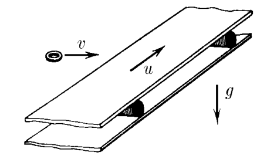
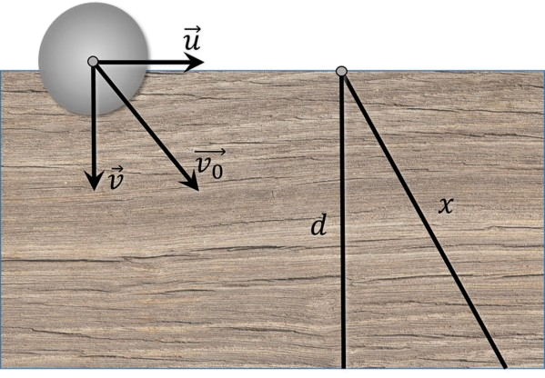

###  Statement 

$2.1.40.$ The horizontal conveyor belt moves at a speed of $u$. A washer flies into the tape at a tangent to it, the initial velocity $v$ of which is perpendicular to the edge of the tape. Find the maximum width of the tape at which the washer will reach its other edge if the coefficient of friction between the washer and the tape is $\mu$. 

### Solution

  Movement of the puck along the tape 

1\. The acceleration of the puck is determined by the equation of Newton's second law: $$ \mu mg=ma $$ $$ a=\mu g $$ 2\. With a conveyor belt width of $d$, the washer will cover a uniformly slow distance of $x$ due to the belt movement. From the similarity of right triangles obtained on the vectors of given speeds and geometric parameters of the washer movement, we find the relationship: $$ \frac{d}{x} =\frac{v}{v_0} $$ $$ \frac{d}{x} =\frac{v}{\sqrt{v^2+u^2}} $$ $$ d =x \frac{v}{\sqrt{v^2+u^2}} $$ 3\. The distance traveled by the washer $x$ can be found from kinematics: $$ \left\\{\begin{matrix} v=v_0-at & \\\ x=v_0t-\frac{at^2}{2} & \end{matrix}\right. $$ $$ v=0\Rightarrow t=\frac{v_0}{a}=\frac{\sqrt{v^2+u^2}}{\mu g} $$ $$ x=\frac{v^2+u^2}{\mu g}-\frac{v^2+u^2}{2\mu g}=\frac{v^2+u^2}{2\mu g} $$ 4\. Next, we substitute the value of $x$ into the equation for $d$ $$ \boxed{d = v\frac{\sqrt{v^2+u^2}}{2\mu g}} $$ 

#### Answer

$$d =\frac{v}{2\mu g} \sqrt{v^2+u^2}$$ 
