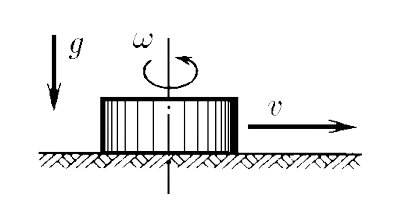
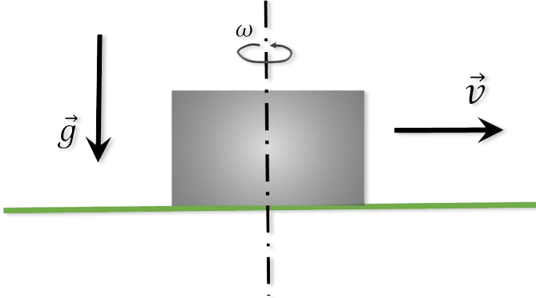

###  Statement

$2.1.41.$ Which washer, rotating around its axis or not rotating, will go the longest way to stop on a rough horizontal surface? The initial velocity of the puck centers is the same.

### Solution

  Motion of a rotating puck

1\. A reciprocating puck has only the kinetic energy of reciprocating motion

$$
K_1=\frac{mv^2}{2}
$$

the flat motion of the puck, which is a superposition of translational and rotational motion, is characterized by two components of kinetic energy: translational and rotational:

$$
K_2=\frac{mv^2}{2}+J_z\frac{\omega^2}{2}
$$

$$
K_2=\frac{mv^2}{2}+\frac{mr^2}{2}\cdot\frac{\omega^2}{2}
$$

$$
K_2=\frac{m}{2}(v^2+\frac{r^2 \omega^2}{2})
$$

$$
K_2=\frac{3}{4}mv^2
$$

$$
K_2>K_1
$$

2\. The initial kinetic energy of the washers in both cases will be spent on work against the friction force.

$$
A_{тр} = \mu mg\Delta x
$$

3\. According to the theorem on the change in kinetic energy:

$$
\frac{K_2}{K_1}=\frac{\Delta x_2}{\Delta x_1}=1.5
$$

#### Answer

Rotating