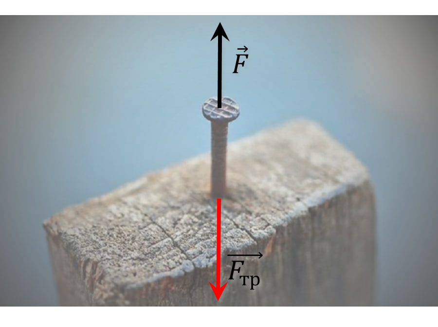

###  Statement 

$2.1.42.$ Why is it easier to pull out a nail that is firmly embedded in a log if you simultaneously rotate it around its own axis when pulling it out? 

### Solution

The sliding friction force acts along the line of motion in the opposite direction; its magnitude is determined only by the coefficient of friction of the surfaces (i.e. for a given nail it is conditionally constant in magnitude and does not depend on the method of motion). 

If you pull it straight, you need to apply a large force along the axis of the nail. And if you rotate it, the friction force vector rotates from the axis of the nail, decomposing into two perpendicular forces: a small axial force and a large radial force. A large radial force is overcome with a lever (the length of the pliers handles is much greater than the diameter of the nail). A small axial component remains, which is easy to overcome. 
