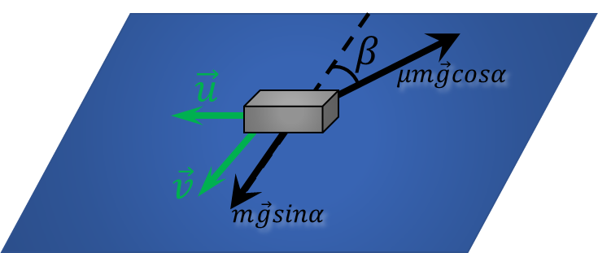

###  Statement

$2.1.44^*.$ Determine the steady-state velocity of a body on an inclined plane that changes one direction of its velocity $u$ to the opposite direction with high frequency. The direction of movement of the plane is shown in the figure. Coefficient of friction $\mu$, angle of inclination of the plane $\alpha$, $\tan\alpha < \mu$.

### Solution

Since the speed changes quickly, the body does not have time to move in the horizontal direction and all the time moves in the direction of $\vec{v}$

Since $v=\text{const}$, there is no acceleration in the direction along the speed $\vec{v}$

$$
mg\sin\alpha = \mu mg \cos\alpha\cos\beta
$$

$$
\cos\beta = \frac{\tan\alpha}{\mu}
$$

From geometric considerations, the moduli of the vectors $\vec{v}$ and $\vec{u}$ are related by the relation

$$
v=\frac{u}{\tan\beta}
$$

$$
v=u \frac{\frac{\tan\alpha}{\mu}}{\sqrt{1-\frac{\tan^2\alpha}{\mu^2}}}
$$

$$
\boxed{v = u \frac{\tan\alpha}{\sqrt{\mu^{2} − \tan^{2} \alpha}}}
$$

#### Answer

$$
v = u \frac{\, \text{tg} \alpha}{\sqrt{\mu^{2} − \text{tg}^{2} \alpha}}
$$