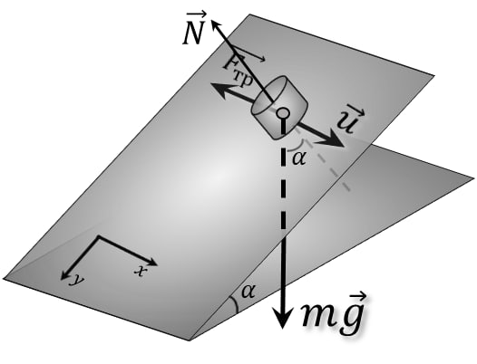
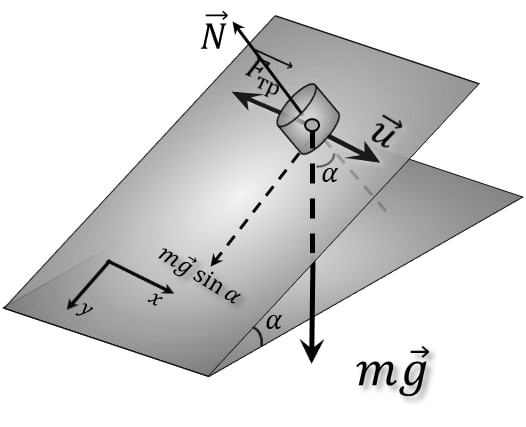
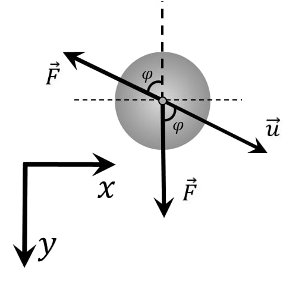

###  Statement 

$2.1.45^*.$ A coin is placed on a plane whose slope tangent is equal to the coefficient of friction. In the horizontal direction along the plane, the coin was given a velocity $v$. Find the steady speed of the coin. 

### Solution

Projecting $m\vec{g}$ on $OY$: 

From the figure, we find the support reaction force: $$ N=mg \cos\alpha$$ According to the Amontons-Coulomb Law: $$ F_{тр}=\mu N=\mu mg \cos\alpha$$ Since $\mu = \tan\alpha$ (by condition): $$ F_{тр}=\mu mg \cos\alpha$$ $$ F_{тр}=mg \cdot \tan\alpha\cdot \cos\alpha =mg \sin\alpha$$ $$ F=mg \sin\alpha$$ Redraw in the $XY$ plane At the initial moment $(\varphi=90^{\circ})$: 

At the final moment $(\varphi=0^{\circ})$: 

Let's consider an arbitrary moment: 

Note that $\varphi$ changes from $0^{\circ}$ to $90^{\circ}$: 

Let's write Newton's second law: $$ \left\\{\begin{matrix} \frac{du_x}{dt} = \frac{F \sin \varphi }{m}& \\\ \frac{du_y}{dt} = \frac{F (1- \cos \varphi) }{m} & \end{matrix}\right. $$ $$ \left\\{\begin{matrix} \frac{d}{dt} (u \sin\varphi)= \frac{F \sin \varphi }{m}& \\\ \frac{d}{dt} (u \cos\varphi) = \frac{F (1- \cos \varphi) }{m} & \end{matrix}\right. $$ We solve the system of differential equations: $$ \left\\{\begin{matrix} \frac{d\varphi}{dt} = \frac{F \sin \varphi }{mu}& (a)\\\ \frac{du}{dt} = \frac{F (1- \cos \varphi) }{m} & (b) \end{matrix}\right. $$ We divide $(b)$ by $(a)$: $$ \frac{du}{d\varphi} = u\frac{1- \cos \varphi}{\sin \varphi} $$ $$ \frac{du}{u} = \frac{1- \cos \varphi}{\sin \varphi} d\varphi $$ $$ \frac{du}{u} = tg (\frac{\varphi}{2}) d\varphi $$ We integrate both parts of the equation:  $$ \int \frac{du}{u} = \int tg (\frac{\varphi}{2}) d\varphi \; (c) $$ $$ \int\frac{du}{u}=ln|u| \; (d) $$ $$ \int tg (\frac{\varphi}{2}) d\varphi=-2 ln(\cos(\frac{x}{2})) \; (e) $$ Substitute $(e)$ and $(d)$ into $(c)$: 

$$ ln(v)+C=ln(\sin(\varphi)) -(ln(\sin(\frac{\varphi}{2})-\cos(\frac{\varphi}{2})))\; (e) $$ 

$$ \boxed{v_x=\frac{v}{2}} $$ 

#### Answer

$$ v_x=\frac{v}{2} $$ 
