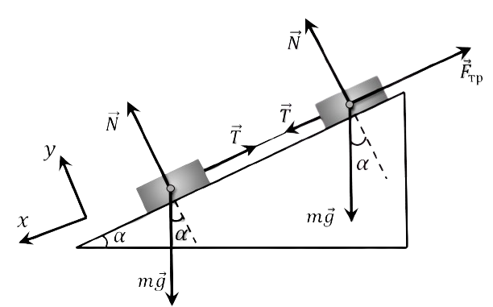

###  Statement 

$2.1.46.$ Two bodies of the same mass connected by a thread slide along an inclined plane. Thread tension force $T$. There is no friction between one body and the board. Determine the friction force between the board and another body. 

### Solution

1\. Since bodies of the same mass move down the plane with a stretched thread, the upper body will have a rough surface. The bodies will have the same accelerations with a stretched thread. 

2\. Let's write the equations of Newton's second law in projection on the direction of motion for each body separately: $$ \left\\{\begin{matrix} m_1g\,\sin\alpha -T=m_1a_1 & \\\ m_1g\,\sin\alpha +T-F_т=m_2a_2 & \end{matrix}\right. $$ $$ a_1=a_2 $$ $$ m_1=m_2 $$ $$ mg\,\sin\alpha +T-F_т=mg\,\sin\alpha -T $$ $$ F_т=2T $$ 

#### Answer

$$F = 2T$$ 
