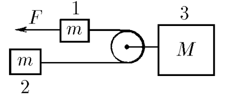
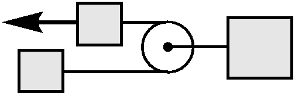

###  Statement 

$2.1.47^*.$ Two bodies of the same mass connected by a thread slide along an inclined plane. Thread tension force $T$. There is no friction between one body and the board. Determine the friction force between the board and another body. 

### Solution

  System of connected bodies 

Body of mass $m_3$ moves with acceleration of the center of mass of the system 

Considering the system as a whole (not taking into account internal forces) $$ \boxed{a_3 = \frac{F}{M+2m}} $$ In this case, a force equivalent to double the tension force of the thread $2T$ acts on the body $m_3$. $$ 2T = M a_3 $$ $$ T = F\frac{M}{2(M+2m)} $$ The body $m_1$ is acted upon by two forces $\vec{T}$ and $\vec{F}$ 

We write Newton's second law for the first body as $$ F-T = ma_1 $$ $$ \boxed{a_1=\frac{F(M+4m)}{2m(M+2m)}} $$ Similarly, the second body $m_2$ is acted upon only by $\vec{T}$ $$ m_2 = T $$ $$ \boxed{a_2=\frac{FM}{2m(M+2m)}} $$ 

#### Answer

Acceleration of cargoes 1–3: $$ a_1=\frac{F(M+4m)}{2m(M+2m)} $$ $$ a_2=\frac{FM}{2m(M+2m)} $$ $$ a_3=\frac{F}{M+2m} $$ 
