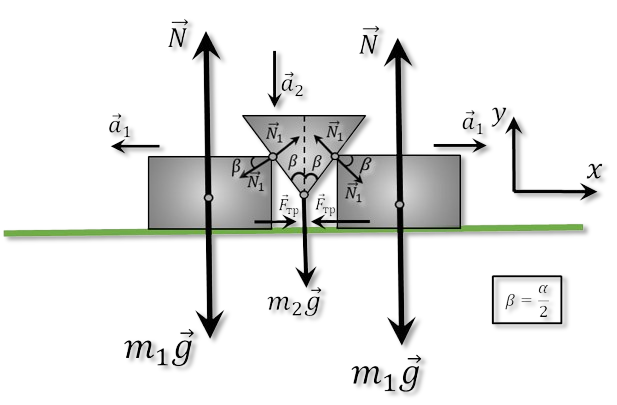

###  Statement

$2.1.48.$ A wedge of mass $m_2$ with an angle $\alpha$ is inserted between two identical smooth bars of mass $m_1$. Determine the acceleration of bodies.

### Solution

  Forces acting on the system

Let us consider a small displacement over time $dt$ from the point of view of kinematics:

  Small transition in time $dt$

From geometric considerations:

$$
dy = dx \cdot c\tan\beta
$$

Let us differentiate both parts of the expression twice:

$$
\frac{dy}{d^2t} = \frac{dx}{d^2t} \cdot c\tan\beta
$$

$$
a_1 = a_2 \cdot \tan\beta\quad(1)
$$

Since the Author did not say anything about friction, example $F_{tr}=0$ Next, we write Newton's 2nd law for the bar $m_1$ on the $OY$ axis:

$$
m_1a_1=N_1\cos\beta
$$

$$
N_1=\frac{m_1a_1}{\cos\beta}\quad(a)
$$

Similarly for $m_2$:

$$
m_2a_2=m_2g-2N_1\,\sin\beta\quad(b)
$$

Substitute $(a)$ into $(b)$:

$$
m_2a_2=m_2g-2m_1a_1\cdot \tan\beta
$$

We substitute $(1)$ into $(c)$:

$$
m_2a_2=m_2g-2m_1a_2\cdot \tan^2\beta
$$

We express $a_2$:

$$
\boxed{a_2=\frac{m_2g}{m_2+2m_1\,\tan^2\beta}}\quad(d)
$$

Given $(1)$, we multiply $(d)$ by $\tan\beta$:

$$
\boxed{a_1=\frac{m_2g\,\tan\beta}{m_2+2m_1\,\tan^2\beta}}
$$

#### Answer

$$
a_1=\frac{m_2g\,\tan\beta}{m_2+2m_1\,\tan^2\beta}
$$

$$
a_2=\frac{m_2g}{m_2+2m_1\,\tan^2\beta}
$$