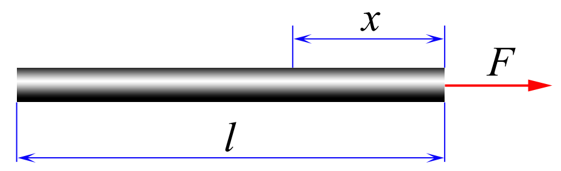

###  Statement 

$2.1.5.$ What force acts in the cross-section of a homogeneous rod of length $l$ at a distance $x$ from the end to which the force $F$ is applied along the rod? 

### Solution

  Forces acting on a small area 

If we consider a rod of mass $m$ as a single whole, then it will move with acceleration $$ a = \frac{F}{m} $$ Since the rod is inextensible, the acceleration of all its parts is the same and equal to $a$ 

Let's consider a small section of the rod of length $dx$ and mass $dm$. Since the rod is homogeneous $$ dm = m \frac{dx}{l} $$ Let's write down Newton's second law for this section. $$ a\, dm = F(x+dx) - F(x)\quad(1) $$ Where $F(x+dx)$ and $F(x)$ are the interaction forces with neighbors 

Let's integrate expression $(1)$ along the horizontal coordinate $x$: $$ \int_x^l am\frac{dx}{l} = \int_x^l dF $$ $$ ma\frac{l-x}{l} $$ $$ F(x) = \fbox{$F(1-\frac{x}{l})$} $$ 

#### Answer

$$T = F(1 − x/l)$$ 
