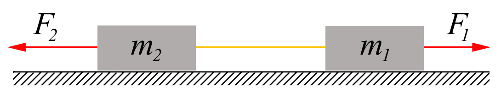
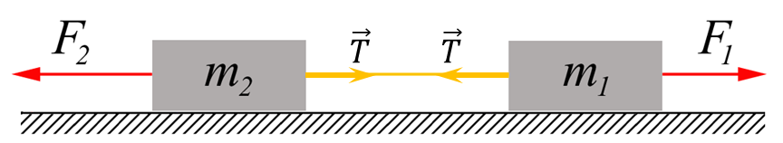

###  Statement 

$2.1.6.$ Two bodies of mass $m_1$ and $m_2$ are connected by a thread that can withstand the tension force $T$. Forces $F_1 = \alpha t$ and $F_2 = 2 \alpha t$ are applied to the bodies, where $\alpha$ is a constant coefficient, and $t$ is the time of action of the force. Determine at what point in time the thread will break. 

### Solution

Let's write Newton's second law for both bars along the horizontal axis $$ \left\\{\begin{matrix} m_2 a = F_2 - T\\\ m_1 a = T - F_1 \end{matrix}\right. $$ 

Reduce for acceleration $a$ $$ \frac{m_2}{m_1} = \frac{F_2 - T}{T - F_1} $$ $$ \frac{m_2}{m_1} = \frac{2\alpha t - T}{T - \alpha t} $$ Express $T$ $$ T = \alpha t \frac{2m_1+m_2}{m_1+m_2} $$ Where does the time until the thread breaks $T$ come from? $$ \fbox{$t = \frac{T}{\alpha}\frac{m_1 + m_2}{(2m_1 + m_2)}$} $$ 

#### Answer

$$t = \frac{T}{\alpha}\frac{m_1 + m_2}{(2m_1 + m_2)}$$ 
