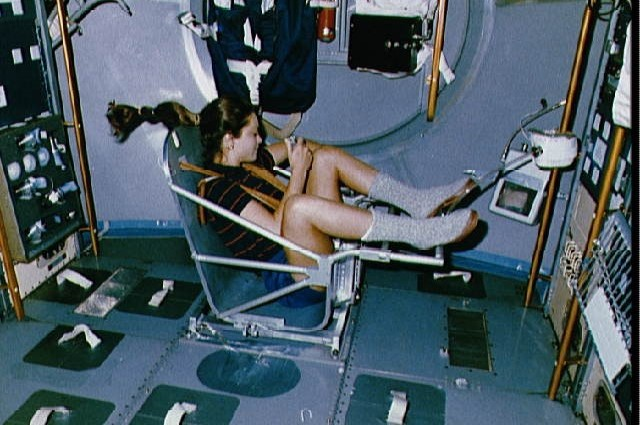

###  Statement 

$2.1.7.$ To measure the mass of an astronaut on an orbital station, a movable seat of known mass $m_0$ attached to a spring is used. With the same initial spring deformation (compression), the empty seat returns to its original position after a time $t_0$, but if the astronaut is on the seat, it returns after a time $t > t_0$. What is the mass of an astronaut? 

### Solution

Let's write Newton's second law with an astronaut $$ kx_2 = (m_0 + m) a_2 $$ And with an empty chair $$ kx_1 = m_0 a_1 $$ Let's take into account uniformly accelerated motion $$ \left\\{\begin{matrix} k \frac{a_1t_0^2}{2} = m_0 a_1\\\ k \frac{a_2t^2}{2} = (m_0+m) a_2 \end{matrix}\right. $$ From the first equation $$ k = \frac{2m_0}{t_0^2} $$ We substitute into the second $$ \fbox{$m = m_0(\frac{t^2}{t^2_0} − 1)$} $$ 

#### Answer

$$m = m_0[(t/t_0)^2 − 1]$$ 
