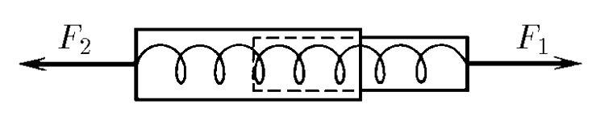

###  Statement 

$2.1.8.$ The dynamometer consists of two cylinders connected by a light spring. Find the ratio of the masses of these cylinders if, with forces $F_1$ and $F_2$ applied to them, the dynamometer shows a force of $F$ 

### Solution

  Forces acting on the dynamometer 

Let's write Newton's second law for the horizontal axis $Ox$ $$ \left\\{\begin{matrix} F_2 - F = m_2 a\\\ F-F_1=m_1a \end{matrix}\right. $$ From here we express the mass ratio $$ \fbox{$\frac{m_2}{m_1} = \frac{F_2 - F}{F - F_1}$} $$ 

#### Answer

$$\frac{m_2}{m_1} = \frac{F_2 - F}{F - F_1}$$ 
