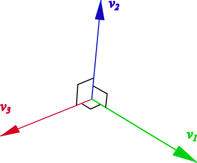

###  Statement

$2.2.16$ The radioactive core decayed into three fragments of mass $m_1$, $m_2$, and $m_3$, having mutually perpendicular velocities $v_1$, $v_2$, and $v_3$, respectively. What was the speed of the nucleus before the decay?

### Solution

Let's consider the following figure

From Momentum Conservation Law (MCL)

$$
(m_1+m_2+m_3)~\vec{V} = m_1\vec{v_1}+m_2\vec{v_2}+m_3\vec{v_3}
$$

Since velocity's vectors are mutually perpendicular, their directions can be fundamental for establishing the spatial coordinated system. So, let be $\hat{v_1}$, $\hat{v_2}$ and $\hat{v_3}$ the unitary vectors for each direction. Applying MCL for each direction,

$$
(m_1+m_2+m_3)V_1 = m_1v_1 \quad(1)
$$

$$
(m_1+m_2+m_3)V_2 = m_2v_2 \quad(2)
$$

$$
(m_1+m_2+m_3)V_3 = m_3v_3 \quad(3)
$$

where $V_1$, $V_2$ and $V_3$ are the components of velocity $\vec{V}$,

$$
V=\sqrt{V_1^2+V_2^2+V_3^2} \quad(4)
$$

Substituting $(1)$, $(2)$ and $(3)$ into $(4)$

$$
\boxed{V=\frac{\sqrt{m_1^2v_1^2+m_2^2v_2^2+m_3^2v_3^2}}{m_1+m_2+m_3}}
$$