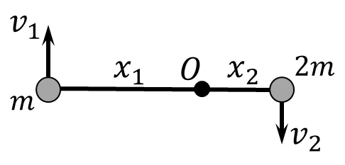

###  Statement

$2.2.23.$ To create artificial gravity, two compartments of the orbital station (mass ratio $1 : 2$) were separated by a distance $R$ from each other and spun around their common center of mass. Determine the time of complete rotation of the compartments if, in a more massive compartment, the artificial gravity is half the force of gravity on the Ground.

### Solution

$$
\sum \vec{R}_\text{external} = \vec{0}
$$

$F_3$ - The force of gravity on the ground acting on an object of mass $m$ $F_2$ - The force of gravity on a massive compartment $F_1$ - The force of gravity on the less massive compartment From the statement

$$
\frac{F_3}{F_2} = 2; \frac{m_xg}{m_xg_2}=2 \Rightarrow g_2 = \frac{g}{2}
$$

$$
\frac{m_1}{m_2} = \frac{1}{2}
$$

$$
\frac{F_1}{F_2} = \frac{m_1g_1}{m_2g_2} = \frac{g_1}{2g_2} = \frac{g_1}{g}
$$

Since centrifugal forces $F_1$ and $F_2$ are internal forces, they are equal to

$$
F_1 = F_2 \Rightarrow g_1 = g
$$

Centripetal acceleration could be found as

$$
g_1 = \frac{v_1^2}{x_1}; \quad g_2 = \frac{v_2^2}{x_2}
$$

From where

$$
x_1 = \frac{2mR}{3m}=\frac{2}{3}R; \quad x_2 = R-x_1 = \frac{1}{3}R
$$

Alternatively

$$
v_1 = \sqrt{\frac{2gR}{3}}; \quad v_2 = \sqrt{\frac{gR}{6}}
$$

Then we find the rotation period as the ratio of the trajectory circle length to the velocity of the first body

$$
T = \frac{2\pi x_1}{v_1}
$$

$$
T = 2\pi\cdot \frac{2}{3}R \cdot \sqrt{\frac{3}{2gR}}
$$

$$
\boxed{T=2\pi\sqrt{\frac{2R}{3g}}}
$$

#### Answer

$$
T=2\pi\sqrt{2R/3g}
$$