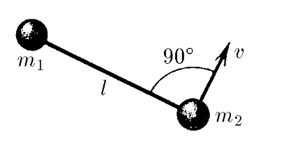

###  Statement 

$2.2.24^*$ Two bodies of mass $m_1$ and $m_2$ are connected by a stretched thread of length $l$ and move along a smooth horizontal surface. At some point in time, it turned out that the first body is stationary, and the velocity of the second body, equal to $v$, is perpendicular to the thread. Determine the tension force of the thread. 

  

### Solution

  Forces acting on the system 

Since point $1$ is at rest, it follows that the forces acting on it are compensated $$\vec{F}_{c1}=-\vec{T}_{1}$$ $$T_1=m_1\omega^2 x$$ Where distance $x$ between point $1$ and center of mass $$x=l\frac{m_2}{m_1+m_2}$$ 

  Direction of forces and velocity of the centre of mass 

Since point $1$ is at rest, the motion is around it. Then the angular velocity of rotation is found through the velocity $v$ of the point $2$ $$\omega = \frac{v}{l}$$ Now, substitute all of this into the expression for $T_1$ $$T_1=m_1\frac{v^2}{l^2} \cdot l\frac{m_2}{m_1+m_2}$$ $$T_1=\frac{m_1m_2v^2}{(m_1+m_2)l}$$ According to Newton's third law, since the thread is weightless, the absolute value of tension force of the thread at point $1$ and point $2$ are equal. $$T_1=T_2=T$$ $$\boxed{T=\frac{m_1m_2}{m_1+m_2}\frac{v^2}{l}}$$ 

#### Answer

$$F=\frac{m_1m_2v^2}{(m_1+m_2)l}$$ 

### Alternative solution

  Forces acting on the system 

Let's consider this system as different bodies. Using Newton's Second law of motion, we can get: $$ \begin{cases} \vec{F}_1 = m_1 \vec{a}_1 \\\ \vec{F}_2 = m_2 \vec{a}_2 \end{cases} \Rightarrow \begin{cases} \vec{a}_1 = \frac{\vec{F}_1}{m_1} \\\ \vec{a}_2 = \frac{\vec{F}_2}{m_2} \end{cases} \quad \text{(1)} $$ Let's subtract $\vec{a}_2$ from $\vec{a}_1$: $$ \vec{a}_1 - \vec{a}_2 = \frac{\vec{F}_1}{m_1} - \frac{\vec{F}_2}{m_2} \quad \text{(2)} $$ 

  Subtraction of vectors 

As we can see, it looks like the derivative of relative velocity: $$ \vec{v}_{B/A} = \vec{v}_B - \vec{v}_A \quad \text{(3)} $$ Now, let's solve the derivative: $$ \frac{d(\vec{v}_{B/A})}{dt} = \frac{d(\vec{v}_B)}{dt} - \frac{d(\vec{v}_A)}{dt} \Rightarrow \vec{a}_{B/A} = \vec{a}_B - \vec{a}_A \quad \text{(4)} $$ This is why we can say that: 

$$ \vec{a}_1 - \vec{a}_2 = \vec{a}_{12} = \frac{\vec{F}_1}{m_1} - \frac{\vec{F}_2}{m_2} \quad \text{(5)} $$ 

Due to the weightlessness of the thread and Newton's Third Law of Motion $\vec{F}_1 = -\vec{F}_2 = \vec{F}$: Eventually: $$ \vec{a}_{12} = \vec{F} \left( \frac{1}{m_1} + \frac{1}{m_2} \right) = \vec{F} \frac{m_1 + m_2}{m_1 m_2} \quad \text{(6)} $$ $a_{12} = \frac{v^2}{l}$, where $l$ is the length of the thread, and $v$ is the relative velocity$\quad (7)$ $$ F = \frac{m_1 m_2}{m_1 + m_2} \frac{v^2}{l} \quad \text{(8)} $$ 
